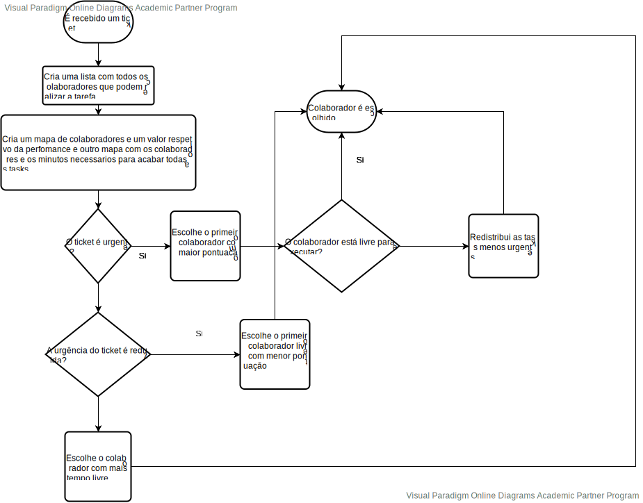

# USDemo1
=======================================


# 1. Requisitos

Como Gestor de Projeto, eu pretendo que seja desenvolvido e integrado no Motor de Fluxos de Atividades algoritmos que assignem automáticamente tarefas a colaboradores de forma a evitar que essas tarefas tenham que ser reivindicadas pelos mesmos.

Este algoritmo tem em conta a performance dos colaboradores nas tarefas antigas.

# 3. Design



## 3.1. Realização da Funcionalidade

*Nesta secção deve apresentar e descrever o fluxo/sequência que permite realizar a funcionalidade.*

# 4. Implementação
 ```
public synchronized Ticket assigningAlgorithm(Ticket ticket) {
        if (ticket.workflow().getFirstIncompleteTask().getClass() == TicketApprovalTask.class) {
            chooseApprovalCollaborator(ticket);
            return ticket;
        } else if (ticket.workflow().getFirstIncompleteTask().getClass() == TicketExecutionTask.class) {
            chooseExecutionCollaborator(ticket);
            return ticket;
        } else if (ticket.workflow().getFirstIncompleteTask().getClass() == TicketAutomaticTask.class){
            return RRAutomaticTask(ticket);
        }
        return ticket;
    }

    private synchronized void chooseApprovalCollaborator(Ticket ticket) {
        Map<Collaborator, Long> collaboratorAndTotalTaskTime = new HashMap<>();
        Map<Collaborator, Float> collaboratorAndFitnessMap = new HashMap<>();
        TicketTask ticketTask = ticket.workflow().getFirstIncompleteTask();
        ApprovalTask approvalTask = (ApprovalTask) ticketTask.mainReference();
        long allCollaboratorTime = 0;
        for (Collaborator collaborator : PersistenceContext.repositories().collaborators().getCollaboratorsByRole(approvalTask.necessaryRoleForApproval())) {
            long timeToFinishAllTasks = new TicketTaskService().getTimeToFinishAllTasks(collaborator);
            allCollaboratorTime += timeToFinishAllTasks;
            collaboratorAndTotalTaskTime.put(collaborator, timeToFinishAllTasks);
            collaboratorAndFitnessMap.put(collaborator, new TicketListService().getCollaboratorPerformanceInApprovalTasks(ticket, collaborator));
        }
        chooseCollaborator(ticket, collaboratorAndTotalTaskTime, collaboratorAndFitnessMap, ticketTask, allCollaboratorTime, null);
    }

    private synchronized void chooseExecutionCollaborator(Ticket ticket) {
        TicketTask ticketTask = ticket.workflow().getFirstIncompleteTask();
        if (ticketTask.transition() != null && ticketTask.transition().hasPreviousTask() && ticketTask.transition().previousTask().getClass() == TicketExecutionTask.class) {
            TicketExecutionTask ticketExecutionTask = (TicketExecutionTask) ticketTask.transition().previousTask();
            new TicketTaskService().addCollaborator(ticketTask, ticketExecutionTask.collaborator());
            return;
        }
        Map<Collaborator, Long> collaboratorAndTotalTaskTime = new HashMap<>();
        Map<Collaborator, Float> collaboratorAndFitnessMap = new HashMap<>();
        ExecutionTask executionTask = (ExecutionTask) ticketTask.mainReference();
        long allCollaboratorTime = 0;
        for (Collaborator collaborator : new TicketTaskService().getCollaboratorByTicketTask(ticketTask)) {
            long timeToFinishAllTasks = new TicketTaskService().getTimeToFinishAllTasks(collaborator);
            allCollaboratorTime += timeToFinishAllTasks;
            collaboratorAndTotalTaskTime.put(collaborator, timeToFinishAllTasks);
            collaboratorAndFitnessMap.put(collaborator, new TicketListService().getCollaboratorPerformanceInApprovalTasks(ticket, collaborator));
        }

        chooseCollaborator(ticket, collaboratorAndTotalTaskTime, collaboratorAndFitnessMap, ticketTask, allCollaboratorTime, null);

    }

    private synchronized void chooseCollaborator(Ticket ticket, Map<Collaborator, Long> collaboratorAndTotalTaskTime, Map<Collaborator, Float> collaboratorAndFitnessMap, TicketTask ticketTask, long allCollaboratorTime, Collaborator collaborator) {
        int limitHours = Integer.parseInt(Application.settings().getProperty("LIMIT_HOURS_OF_TASKS"));
        boolean add = allCollaboratorTime > (long) collaboratorAndTotalTaskTime.size() * limitHours * 60;

        List<Map.Entry<Collaborator, Long>> list
                = new LinkedList<>(
                collaboratorAndTotalTaskTime.entrySet());


        list.sort(Map.Entry.comparingByValue());

        // put data from sorted list to hashmap
        HashMap<Collaborator, Long> temp
                = new LinkedHashMap<>();
        for (Map.Entry<Collaborator, Long> aa : list) {
            temp.put(aa.getKey(), aa.getValue());
        }

        if (ticket.urgency().equals(Urgency.valueOf("urgente"))) {
            List<Map.Entry<Collaborator, Float>> listValue
                    = new LinkedList<>(
                    collaboratorAndFitnessMap.entrySet());


            list.sort(Map.Entry.comparingByValue(Comparator.reverseOrder()));

            // put data from sorted list to hashmap
            HashMap<Collaborator, Float> tempByFitness
                    = new LinkedHashMap<>();
            for (Map.Entry<Collaborator, Float> aa : listValue) {
                tempByFitness.put(aa.getKey(), aa.getValue());
            }

            if (add) {
                new TicketTaskService().addCollaborator(ticketTask, tempByFitness.entrySet().iterator().next().getKey());
            } else {
                for (Map.Entry<Collaborator, Float> entry : tempByFitness.entrySet()) {
                    if (collaboratorAndTotalTaskTime.get(entry.getKey()) + ticketTask.mainReference().maxTimeOfExecution() < limitHours * 60 && !entry.getKey().sameAs(collaborator)) {
                        new TicketTaskService().addCollaborator(ticketTask, entry.getKey());
                        return;
                    } else {
                        if (redistributeTask(entry.getKey(), ticketTask.mainReference().maxTimeOfExecution(), collaboratorAndTotalTaskTime, collaboratorAndFitnessMap) && !entry.getKey().sameAs(collaborator)) {
                            new TicketTaskService().addCollaborator(ticketTask, entry.getKey());
                            return;
                        }
                    }
                }
            }
            return;
        }
        if (ticket.urgency().equals(Urgency.valueOf("reduzida"))) {
            List<Map.Entry<Collaborator, Float>> listValue
                    = new LinkedList<>(
                    collaboratorAndFitnessMap.entrySet());


            list.sort(Map.Entry.comparingByValue());

            // put data from sorted list to hashmap
            HashMap<Collaborator, Float> tempByFitness
                    = new LinkedHashMap<>();
            for (Map.Entry<Collaborator, Float> aa : listValue) {
                tempByFitness.put(aa.getKey(), aa.getValue());
            }

            if (add) {
                new TicketTaskService().addCollaborator(ticketTask, tempByFitness.entrySet().iterator().next().getKey());
            } else {
                for (Map.Entry<Collaborator, Float> entry : tempByFitness.entrySet()) {
                    if (collaboratorAndTotalTaskTime.get(entry.getKey()) + ticketTask.mainReference().maxTimeOfExecution() < limitHours * 60 && !entry.getKey().sameAs(collaborator)) {
                        new TicketTaskService().addCollaborator(ticketTask, entry.getKey());
                        return;
                    }
                }
            }
        } else {
            new TicketTaskService().addCollaborator(ticketTask, temp.entrySet().iterator().next().getKey());
        }


    }

    private synchronized boolean redistributeTask(Collaborator collaborator, long minutesOfExecution, Map<
            Collaborator, Long> collaboratorAndTotalTaskTime, Map<Collaborator, Float> collaboratorAndFitnessMap) {
        List<Ticket> ticketList = new ArrayList<>();
        long timeNecessary = 0;
        for (TicketTask ticketTask : new TicketTaskService().getPendingApprovalTasks(collaborator)) {
            Ticket ticket = new TicketTaskService().getTicketByTicketTask(ticketTask);
            if (!ticket.urgency().equals(Urgency.valueOf("urgente")) && timeNecessary < minutesOfExecution) {
                ticketList.add(ticket);
                timeNecessary += ticket.workflow().getFirstIncompleteTask().mainReference().maxTimeOfExecution();
            }
        }
        if (ticketList.isEmpty())
            return false;
        for (Ticket ticket : ticketList) {
            chooseCollaborator(ticket, collaboratorAndTotalTaskTime, collaboratorAndFitnessMap, ticket.workflow().getFirstIncompleteTask(), 0, collaborator);
        }
        return true;

    }
 
 ```

# 5. Integração/Demonstração


