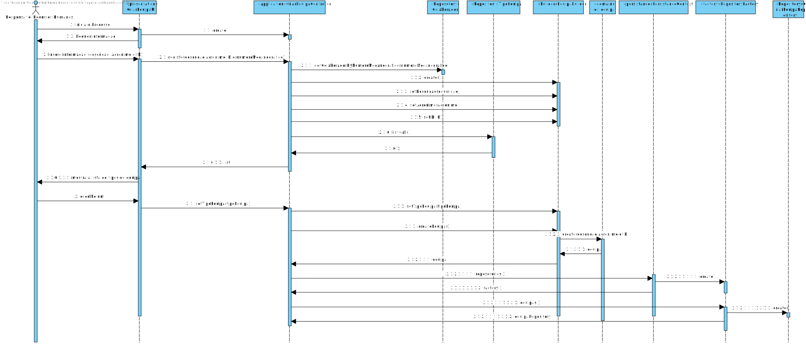

# UC 2052 - Criar uma nova equipa
=======================================


# 1. Requisitos

**UC 2052:**  Como RRH, eu pretendo criar uma nova equipa.


# 2. Análise

Para análise o modelo de domínio dá resposta ao requisito, não sendo assim necessário estender o mesmo. [Verificar modelo de domínio](mdURL)

# 3. Design


## 3.1. Realização da Funcionalidade


Para esta funcionalidade começamos por pedir ao utilizador que insira seguintes valores como o ID, acrónimo e descrição além disso é dada a opção de escolher um tipo de equipa e um colaborador responsável por gerrir a equipa. O UI transmite esses dados ao Controller que por sua vez os manda para o Builer.




## 3.3. Padrões Aplicados

* Pardrão Builder - Para evitar diferentes construtores para diferentes situações e para possibilitar a criação do catalogo por etapas foi usado o padrão Builder.
* Pardrão Factory - e modo a simplificar a a manipulação de diferentes repositorios foi utilizado o padrão Factory.
* Pardrão DTO - de modo a passar informação da camada de dominio para a camada de apresentação foi utilizado o padrão DTO, isolando assim o modelo de dominio da apresentação.

## 3.4. Testes 


**Teste 1:** Verificar que não é possível criar uma instância da classe Exemplo com valores nulos.

	@Test
    public void test() {
        assertEquals(acronimo, new EquipaID("123"));
        assertNotEquals(acronimo, new EquipaID("12"));
        assertThrows(IllegalArgumentException.class,() -> new EquipaID("a"));
        assertThrows(IllegalArgumentException.class,() -> new EquipaID(""));
        assertThrows(IllegalArgumentException.class,() -> new EquipaID(null));
    }


# 4. Implementação

#### Equipa Builder
```
    public Equipa build(){
        Equipa e = new Equipa(designacao,acronimo,equipaID,responsaveis.remove(0),tipoEquipa);
        for (Colaborador colaborador:colaboradores){
            e.addTeamMembers(colaborador);
        }
        for (Colaborador colaborador:responsaveis){
            e.addColaboradorResponsible(colaborador);
        }
        return e;
    }
```

#### Equipa DTO
```
   public class EquipaDTO {
    public String descricao;
    public String acronimo;
    public String equipaID;
    public List<ColaboradorDTO> responsaveis = new ArrayList<>();
    public TipoEquipaDTO tipoEquipaDTO;
    public List<ColaboradorDTO> membrosDaEquipa= new ArrayList<>();
    public ColaboradorDTO colaboradorDTO;

    public EquipaDTO(String descricao, String acronimo, String equipaID, List<ColaboradorDTO> responsaveis, TipoEquipaDTO tipoEquipaDTO, List<ColaboradorDTO> membrosDaEquipa) {
        this.descricao = descricao;
        this.acronimo = acronimo;
        this.equipaID = equipaID;
        this.responsaveis.addAll(responsaveis);
        this.tipoEquipaDTO = tipoEquipaDTO;
        this.membrosDaEquipa.addAll(membrosDaEquipa);
    }

    public EquipaDTO(String descricao, String acronimo, String equipaID, TipoEquipaDTO tipoEquipaDTO, ColaboradorDTO colaboradorDTO) {
        this.descricao = descricao;
        this.acronimo = acronimo;
        this.equipaID = equipaID;
        this.tipoEquipaDTO = tipoEquipaDTO;
        this.colaboradorDTO = colaboradorDTO;
    }
}

```
#### Equipa DTO
```
  public class EquipaDTOParser implements DTOParser<EquipaDTO, Equipa> {
    @Override
    public Equipa valueOf(EquipaDTO dto) {
        EquipaBuilder equipaBuilder = new EquipaBuilder();
        LinkedList<Colaborador> responsaveis = new LinkedList<>();
        dto.responsaveis.forEach(dtoColab -> responsaveis.add(new ColaboradorDTOParser().valueOf(dtoColab)));
        List<Colaborador> membrosDeEquipa = new ArrayList<>();
        dto.membrosDaEquipa.forEach(dtoColab -> membrosDeEquipa.add(new ColaboradorDTOParser().valueOf(dtoColab)));

        return equipaBuilder.designacao(dto.descricao).acronimo(dto.acronimo).equipaID(dto.equipaID).colaboradores(membrosDeEquipa).tipoDeEquipa(new TipoEquipaDTOParser().valueOf(dto.tipoEquipaDTO)).responsaveis(responsaveis).build();
    }
}
```

# 5. Integração/Demonstração

*Nesta secção a equipa deve descrever os esforços realizados no sentido de integrar a funcionalidade desenvolvida com as restantes funcionalidades do sistema.*

# 6. Observações

*Nesta secção sugere-se que a equipa apresente uma perspetiva critica sobre o trabalho desenvolvido apontando, por exemplo, outras alternativas e ou trabalhos futuros relacionados.*


