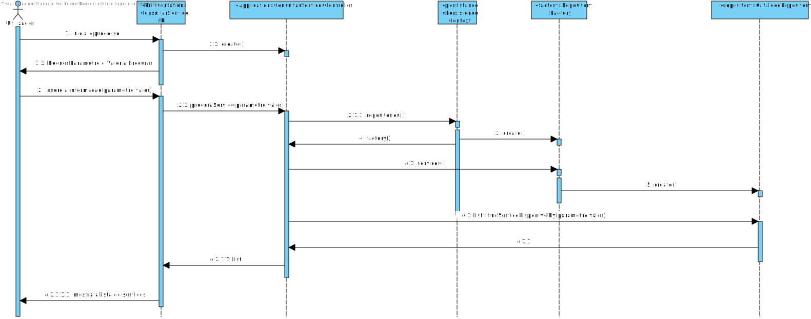

# UC 3001 - Consultar catálogos de serviços e respetivos serviços que me estão disponibilizados
=======================================

# 1. Requisitos

**UC 3001:**  Como utilizador, eu pretendo consultar/pesquisar os catálogos de serviços e respetivos serviços que me estão/são disponibilizados.

# 2. Análise

Para análise o modelo de domínio dá resposta ao requisito, não sendo assim necessário estender o mesmo. [Verificar modelo de domínio](mdURL)

# 3. Design

*Como esta secção consiste em consultar classes já implementadas nas outras UCs, nesta secção só irá conter o SD pois testes e implementação são relativos à UC-2001 e UC-2002 .*

## 3.1. Realização da Funcionalidade

Para esta funcionalidade começamos por pedir ao utilizador que insira seguintes valores como o parâmetro e o valor. O UI transmite esses dados ao Controller que retorna a lista que é impressa pelo UI.

# 4. Integração/Demonstração

*Nesta secção a equipa deve descrever os esforços realizados no sentido de integrar a funcionalidade desenvolvida com as restantes funcionalidades do sistema.*

# 5. Observações

*Nesta secção sugere-se que a equipa apresente uma perspetiva critica sobre o trabalho desenvolvido apontando, por exemplo, outras alternativas e ou trabalhos futuros relacionados.*

