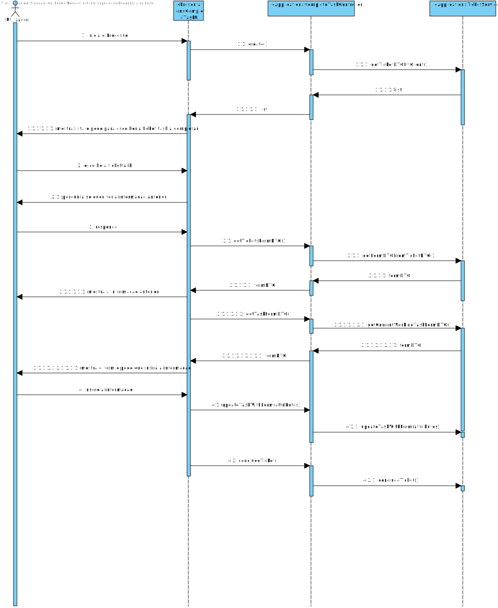

# UC 3023 - Realizar uma Tarefa Pendente
=======================================


# 1. Requisitos

**UC 3023:**  Como Colaborador, eu pretendo realizar tarefas pendentes.


# 2. Análise

Para análise o modelo de domínio dá resposta ao requisito, não sendo assim necessário estender o mesmo. [Verificar modelo de domínio](mdURL)

# 3. Design


## 3.1. Realização da Funcionalidade


Para esta funcionalidade começamos por pedir ao utilizador que insira seguintes valores como o ID, acrónimo e descrição além disso é dada a opção de escolher um tipo de equipa e um colaborador responsável por gerrir a equipa. O UI transmite esses dados ao Controller que por sua vez os manda para o Builer.




## 3.3. Padrões Aplicados

* Pardrão Factory - e modo a simplificar a a manipulação de diferentes repositorios foi utilizado o padrão Factory.
* Pardrão DTO - de modo a passar informação da camada de dominio para a camada de apresentação foi utilizado o padrão DTO, isolando assim o modelo de dominio da apresentação.

## 3.4. Testes 
Como esta US dependia de USs antigas não foi necessário realizar testes relativos a esta US.


# 4. Implementação

#### para evitar usar um setStatus na ticketTask
```
    public void completeTask(){
		this.status = "COMPLETE";
		dateEnded = LocalDateTime.now();
	}
    
```

#### para evitar os sets de satus no ticket e este sao os estados do ticket
```
public void approveTicket() {
        this.status = TicketStatus.valueOf("APPROVED");
    }

    public void disapproveTicket() {
        this.status = TicketStatus.valueOf("DISAPPROVED");
        this.completedOn = LocalDate.now();
    }

    public void pendingExecutingTicket() {
        this.status = TicketStatus.valueOf("PENDING_EXECUTION");
    }

    public void endTicket() {
        this.status = TicketStatus.valueOf("CONCLUDED");
        this.completedOn = LocalDate.now();
    }

```


# 5. Integração/Demonstração

*Nesta secção a equipa deve descrever os esforços realizados no sentido de integrar a funcionalidade desenvolvida com as restantes funcionalidades do sistema.*

# 6. Observações

*Nesta secção sugere-se que a equipa apresente uma perspetiva critica sobre o trabalho desenvolvido apontando, por exemplo, outras alternativas e ou trabalhos futuros relacionados.*


