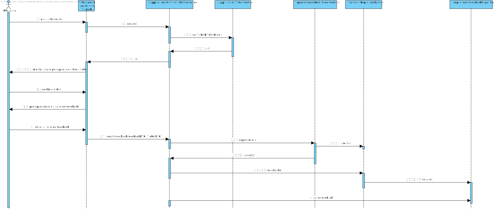

# UC 3051 - Transmitir o Meu Grau de Satisfação Sobre a Resolução
=======================================


# 1. Requisitos

**UC 3023:**  Como utilizador, eu pretendo transmitir o meu grau de satisfação sobre a resolução.


# 2. Análise

Para análise o modelo de domínio dá resposta ao requisito, não sendo assim necessário estender o mesmo. [Verificar modelo de domínio](mdURL)

# 3. Design


## 3.1. Realização da Funcionalidade


Para esta funcionalidade começamos por mostrar ao utilizador os tickets relativos a ele e para escolher um, a seguir pede para introduzir um valor. O UI transmite esses dados ao Controller que por sua vez os manda para o Builer.




## 3.3. Padrões Aplicados

* Pardrão Builder - Para evitar diferentes construtores para diferentes situações a criação do feedback  foi feita com o padrão Builder.
* Pardrão Factory - e modo a simplificar a a manipulação de diferentes repositorios foi utilizado o padrão Factory.
* Pardrão DTO - de modo a passar informação da camada de dominio para a camada de apresentação foi utilizado o padrão DTO, isolando assim o modelo de dominio da apresentação.

## 3.4. Testes 
**Teste 1:** Verificar que não é possível criar uma instância da classe feedback com valores que nao se encontram entre 0 e 5 e certificar que o metodo equals foi corretamente implementado.

	@Test
    public void test() {
        FeedbackValue feedbackValue = new FeedbackValue(1);
        assertEquals(feedbackValue, new FeedbackValue(1));
        assertNotEquals(feedbackValue, new FeedbackValue(2));
        assertThrows(IllegalArgumentException.class,() -> new FeedbackValue(-1));
        assertThrows(IllegalArgumentException.class,() -> new FeedbackValue(10));

    }


# 4. Implementação

#### classe feedbackBuilder
```
    public class FeedbackBuilder {

    private FeedbackValue feedbackValue;
    private String email;

    public FeedbackBuilder withFeedbackValue(FeedbackValue feedbackValue){
        this.feedbackValue = feedbackValue;
        return this;
    }

    public FeedbackBuilder withEmail(String email){
        this.email = email;
        return this;
    }

    public Feedback build(){
        return new Feedback(feedbackValue,email);
    }
}
    
```

#### classe FeedbackDTO
```
    public float id;
    public int feedbackValue;
    public String email;


    public FeedbackDTO(float id, int feedbackValue, String email) {
        this.id = id;

        this.feedbackValue = feedbackValue;
        this.email = email;
    }


    public FeedbackDTO(int feedbackValue, String email) {

        this.feedbackValue = feedbackValue;
        this.email = email;
    }

    public FeedbackDTO( int feedbackValue) {
        this.feedbackValue = feedbackValue;
    }

```


# 5. Integração/Demonstração

*Nesta secção a equipa deve descrever os esforços realizados no sentido de integrar a funcionalidade desenvolvida com as restantes funcionalidades do sistema.*

# 6. Observações

*Nesta secção sugere-se que a equipa apresente uma perspetiva critica sobre o trabalho desenvolvido apontando, por exemplo, outras alternativas e ou trabalhos futuros relacionados.*


