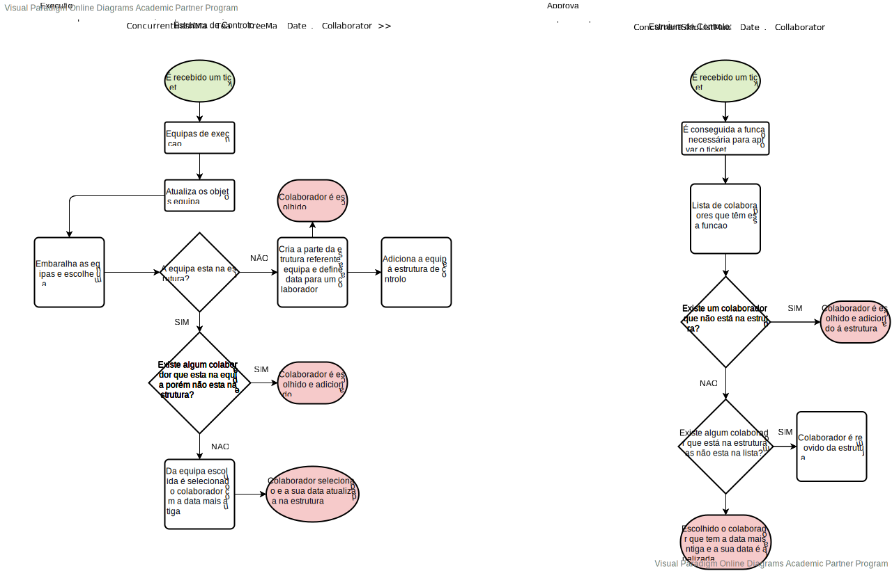

# USDemo1
=======================================


# 1. Requisitos

Como Gestor de Projeto, eu pretendo que seja desenvolvido e integrado no Motor de Fluxos de Atividades algoritmos que assignem automáticamente tarefas a colaboradores de forma a evitar que essas tarefas tenham que ser reivindicadas pelos mesmos.

Baseado em First Came First Served (entre colaboradores de cada equipa)

O uso ou não de um destes algoritmo e qual o algoritmo a usar deve ser configurável no sistema.


# 3. Design



## 3.1. Realização da Funcionalidade

*Nesta secção deve apresentar e descrever o fluxo/sequência que permite realizar a funcionalidade.*

# 4. Implementação
 ```
static ConcurrentHashMap<Team, TreeMap<Date, Collaborator>> historyExecution = new ConcurrentHashMap<>();
static ConcurrentSkipListMap<Date, Collaborator> historyApproval = new ConcurrentSkipListMap<>();

 public Collaborator assignCollaboratorExecution(Ticket ticket) {

        TeamRepository teamRepository = PersistenceContext.repositories().teams();

        Collaborator theChosenOne;
        ArrayList<Collaborator> collaborators = new ArrayList<>();
        ArrayList<Team> execTeams = new ArrayList<>();
        ArrayList<Team> execTeamsUpdated = new ArrayList<>();
        Service svr = ticket.service();

        //if (ticket.workflow().getFirstIncompleteTask() instanceof TicketExecutionTask) {
        execTeams.addAll(((ExecutionTask) ticket.workflow().getFirstIncompleteTask().mainReference()).executingTeams());
        //}
        for (Team t : execTeams) { //update teams
            execTeamsUpdated.add(teamRepository.ofIdentity(t.identity()).get());
        }
        execTeams.clear();// delete old list

        for (Team t : execTeamsUpdated) { //save updated collaborators
            collaborators.addAll(t.teamMembers());
        }

        for (Team t : execTeamsUpdated) {
            if (!historyExecution.containsKey(t)) { //se a equipa nao esta no historico escolhe um elemento dessa equipa
                TreeMap<Date, Collaborator> teamHistory = new TreeMap<>();
                theChosenOne = t.teamMembers().iterator().next();
                teamHistory.put(new Date(), theChosenOne);
                historyExecution.put(t, teamHistory);
                return theChosenOne;
            }
        }

        for (Team team : historyExecution.keySet()) {//se a equipa esta no historico mas nem todos os colaboradores ja foram selecionados
            Collections.shuffle(execTeamsUpdated);
            TreeMap<Date, Collaborator> teamHistory = historyExecution.get(team);
            for (Team team2 : execTeamsUpdated) {
                if (team2.equals(team)) {
                    for (Collaborator c : team2.teamMembers()) {
                        if (!teamHistory.containsValue(c)) {
                            theChosenOne = c;
                            teamHistory.put(new Date(), theChosenOne);
                            historyExecution.remove(team);
                            historyExecution.put(team, teamHistory);
                            return theChosenOne;
                        } else {
                            theChosenOne = teamHistory.firstEntry().getValue();//se nao escolhe o mais antigo
                            teamHistory.remove(teamHistory.firstEntry());
                            teamHistory.put(new Date(), theChosenOne);
                            historyExecution.remove(team);
                            historyExecution.put(team, teamHistory);
                            return theChosenOne;
                        }
                    }
                }
            }
        }
        return null;
    }

    public Collaborator assignCollaboratorApproval(Ticket ticket) {


        CollaboratorRepository collaboratorRepository = PersistenceContext.repositories().collaborators();
        Task app = ticket.workflow().starterTask().mainReference();
        ApprovalTask aprov = (ApprovalTask) app;
        ArrayList<Collaborator> col = (ArrayList<Collaborator>) collaboratorRepository.getCollaboratorListByFunction(((ApprovalTask) app).necessaryRoleForApproval());

        for (Date date : historyApproval.keySet()) { //remover colaboradores que foram removidos
            if (!col.contains(historyApproval.get(date))) {
                historyApproval.remove(date);
            }
        }

        for (Collaborator collaborator : col) { //verificar se foram adicionados novos colaboradores
            if (!historyApproval.containsValue(collaborator)) {
                historyApproval.put(new Date(), collaborator);
                return collaborator;
            }
        }

        Collaborator collaborator = historyApproval.firstEntry().getValue();//escolher o mais antigo
        historyApproval.remove(historyApproval.firstEntry().getKey());
        historyApproval.put(new Date(), collaborator);

        return collaborator;
    }
 
 ```

# 5. Integração/Demonstração


