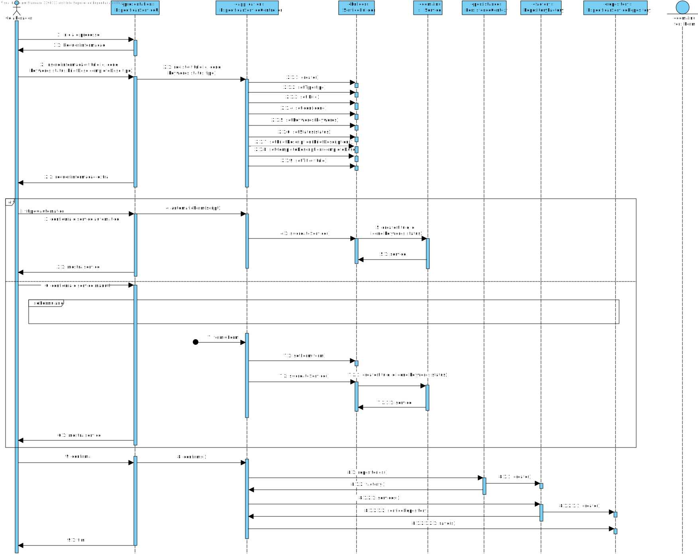
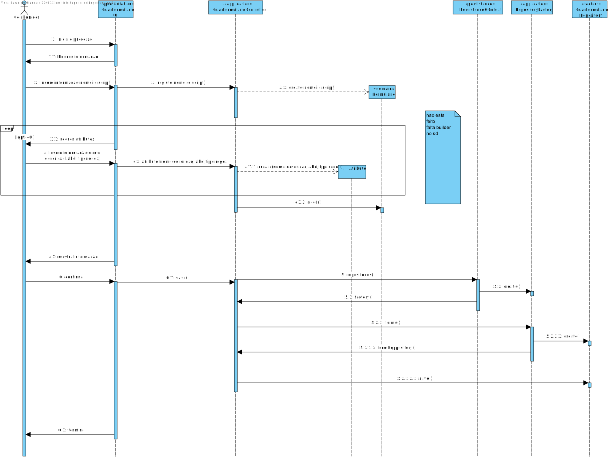
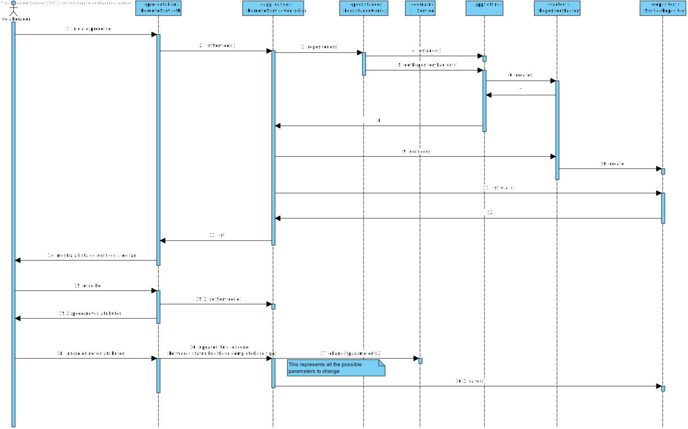
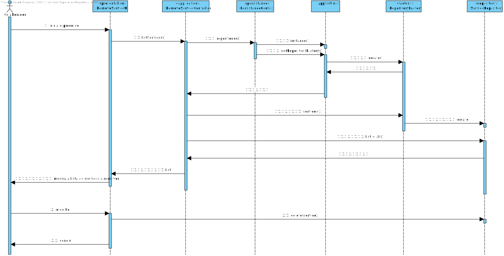

# UC 2002 -  Especificar Servico
=======================================


# 1. Requisitos

Como GSH, eu pretendo proceder à especificação de um novo serviço, devendo o sistema permitir que a mesma fique incompleta e seja, posteriormente, retomada.

Critérios de Aceitação / Observações :

- O serviço só deve ficar disponivel para solicitação quando a sua especificação ficar completa e válida.

- Apenas informação base do serviço (código, descrição, catálogo onde será disponibilizado, formulários, requer feedback).

Exemplo de tipos de dados a considerar nos formulários: Inteiro, String, Bool, Data, Ficheiro, ListaDeValores (Enumerado).

.png)
.png)
.png)
.png)
.png)
.png)


# 2. Análise

*Neste secção a equipa deve relatar o estudo/análise/comparação que fez com o intuito de tomar as melhores opções de design para a funcionalidade bem como aplicar diagramas/artefactos de análise adequados.*

*Recomenda-se que organize este conteúdo por subsecções.*

# 3. Design

#### Especificar Servico

####Formulario

#### Editar Servico


#### Remover Servico



## 3.1. Realização da Funcionalidade

*Nesta secção deve apresentar e descrever o fluxo/sequência que permite realizar a funcionalidade.*

## 3.3. Padrões Aplicados

- Builder - Padrão de design que permite construir objetos complexos passo a passo.Este permite produzir diferentes tipos e representações de um objeto usando o mesmo código de construção.

- Factory - O Factory Method é um padrão de design que fornece uma interface para a criação de objetos numa superclasse, mas permite que as subclasses alterem o tipo de objetos que serão criados.

- DTO

## 3.4. Testes 


**Teste 1:** Verificar que não é possível criar uma instância da classe Exemplo com valores nulos e inválidos.

	@Test
    public void test() {
        assertEquals(id, new ServicoID("32"));
        assertNotEquals(id, new ServicoID("2"));
        assertThrows(IllegalArgumentException.class,() -> new ServicoID("Aa32!"));
        assertThrows(IllegalArgumentException.class,() -> new ServicoID(" "));
        assertThrows(IllegalArgumentException.class,() -> new ServicoID(null));
    }

# 4. Implementação

#### Servico Builder
```
    public Servico buildManual() {
        return new Servico(title, id, icon, keywords, status, TipoServico.valueOf("MANUAL"),compDesc,briefDesc,script,form,catalogo);
    }

    public Servico buildAutomatic() {
        return new Servico(title, id, icon, keywords, status, TipoServico.valueOf("AUTOMATICO"),compDesc,briefDesc,script,form,catalogo);

    }

    public ServicoBuilder withTitle(String title) {
        this.title = TituloServico.valueOf(title);
        return this;
    }

    public ServicoBuilder withBriefDesc(String desc) {
        this.briefDesc = BriefDescription.valueOf(desc);
        return this;
    }
```
#### Formulario Builder
```
    public class FormularioBuilder {
    private FormularioScript script;
    private FormularioID id;
    private FormularioNome nome;
    private Set<Atributo> atr;

    public Formulario build(){
        return  new Formulario(script, id, nome,atr);
    }

    public FormularioBuilder setScript(String script) {
        this.script = FormularioScript.valueOf(script);
        return this;
    }

    public FormularioBuilder setId(String id) {
        this.id = FormularioID.valueOf(id);
        return this;
    }

    public FormularioBuilder setNome(String nome) {
        this.nome = FormularioNome.valueOf(nome);
        return this;
    }

    public FormularioBuilder setAtr(Set<Atributo> atr) {
        this.atr = atr;
        return this;
    }
}
```
#### Formulario DTO
```
   public class FormularioDTO {
    public String script;
    public String id;
    public String nome;
    public Set<AtributoDTO> atrDTO;
    public FormularioDTO(String script, String id, String nome, Set<AtributoDTO> atr) {
        this.script= script;
        this.id= id;
        this.nome= nome;
        this.atrDTO = atr;
    }

}

```
#### Formulario DTO Parser
```
   public class FormularioDTOParser implements DTOParser<FormularioDTO, Formulario> {
    @Override
    public Formulario valueOf(FormularioDTO dto) {
        FormularioBuilder svb = new FormularioBuilder();
        Set<Atributo> atr = new HashSet<>();
        for (AtributoDTO atributo:dto.atrDTO) {
            atr.add(new Atributo(AtributoNome.valueOf(atributo.nome), AtributoLabel.valueOf(atributo.label), AtributoDescricao.valueOf(atributo.desc), AtributoRegex.valueOf(atributo.regex),AtributoTipo.valueOf(atributo.tipo),AtributoID.valueOf(atributo.id)));
        }
        return svb.setAtr(atr).setId(dto.id).setNome(dto.nome).setScript(dto.script).build();
    }
}
```

}

# 5. Integração/Demonstração

*Nesta secção a equipa deve descrever os esforços realizados no sentido de integrar a funcionalidade desenvolvida com as restantes funcionalidades do sistema.*

# 6. Observações

*Nesta secção sugere-se que a equipa apresente uma perspetiva critica sobre o trabalho desenvolvido apontando, por exemplo, outras alternativas e ou trabalhos futuros relacionados.*


