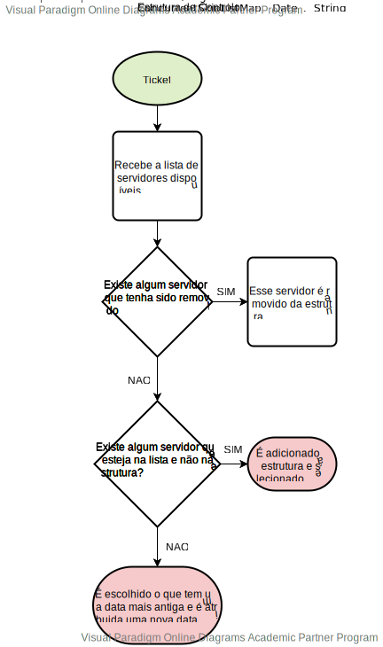

# US4071 - Desenvolver algoritmos que distribuam a realização de tarefas automáticas
=======================================


# 1. Requisitos

**UC 4071:** Como Gestor de Projeto, eu pretendo que seja desenvolvido e integrado no Motor de Fluxos de Atividades  algoritmos que distribuam a realização de tarefas automáticas pelas diversas instâncias do Executor de Tarefas Automáticas existentes na infraestrutura instalada.


Critérios de Aceitação / Observações:
- Pretende-se que sejam desenvolvidos dois algoritmos distintos baseado em First Came First Served  (entre instâncias do Executor de Tarefas)

- O algoritmo a ser adotado pelo sistema deve ser definido por configuração.


# 3. Design



## 3.1. Realização da Funcionalidade

*Nesta secção deve apresentar e descrever o fluxo/sequência que permite realizar a funcionalidade.*

# 4. Implementação
 ```java
static ConcurrentSkipListMap<Date, String> historyAutomaticTask = new ConcurrentSkipListMap<>();

 ublic Ticket FCFSTicket(Ticket ticket) {

        Collaborator selected = null;


        if (ticket.workflow().getFirstIncompleteTask() instanceof TicketApprovalTask) {
            selected = assignCollaboratorApproval(ticket);
            ((TicketApprovalTask) ticket.workflow().getFirstIncompleteTask()).setApprovedBy(selected);
        } else

            if (ticket.workflow().getFirstIncompleteTask() instanceof TicketExecutionTask) {
                selected = assignCollaboratorExecution(ticket);
                ((TicketExecutionTask) ticket.workflow().getFirstIncompleteTask()).setExecutedBy(selected);
            } else

                if (ticket.workflow().starterTask().getFirstIncompleteTask() instanceof TicketAutomaticTask) {
                    FCFSAutomaticTask(ticket);
                }


        return ticket;
    }

    public Ticket FCFSAutomaticTask(Ticket ticket) {

        String selected = "";
        try {
            if (ticket.workflow().getFirstIncompleteTask() instanceof TicketAutomaticTask) {
                selected = assignServer();
                TcpExecuterClient client = new TcpExecuterClient();
                if (client.startConnection(selected)) {
                    if(client.executeAutomaticTask(ticket))
                        new CompleteTaskController().concludeAutomaticTicket(ticket.workflow().getFirstIncompleteTask());
                    client.stopConnection();
                }
            }
        } catch (IOException e) {
            System.out.println("An error ocorred");
        }

        return ticket;
    }

    public String assignServer() {

        String theChosenOne = "";
        List<String> serverList = new LinkedList<>();
        try {
            File myObj = new File("Executer_ip_list.txt");
            Scanner myReader = new Scanner(myObj);
            while (myReader.hasNextLine()) {
                String ip = myReader.nextLine();
                serverList.add(ip.trim());
            }
            myReader.close();
        } catch (FileNotFoundException e) {
            System.out.println("An error occurred while trying to read the ip list.");
            return null;
        }

        for (Date date : historyAutomaticTask.keySet()) {
            if (!serverList.contains(historyAutomaticTask.get(date))) {   //se algum servidor for removido retira do historico
                historyAutomaticTask.remove(date);
            }
        }

        for (String server : serverList) { //verificar se existe algum que ainda nao tenha feito nada
            if (!historyAutomaticTask.containsValue(server)) {
                theChosenOne = server;
                historyAutomaticTask.put(new Date(), server);
            }
        }

        if (theChosenOne.equals("")) { //se todos ja tiverem feito pelo menos um, vai verificar o que fez ha mais tempo
            for (Date date : historyAutomaticTask.keySet()) {
                if (serverList.contains(historyAutomaticTask.get(date))) {
                    theChosenOne = historyAutomaticTask.get(date);
                    historyAutomaticTask.put(new Date(), historyAutomaticTask.remove(date));
                }
            }
        }
        return theChosenOne;
    }
 
 ```

# 5. Integração/Demonstração


