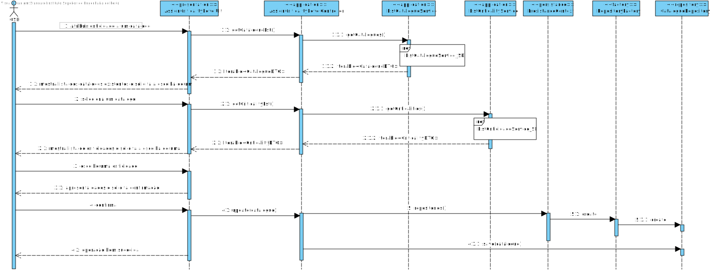
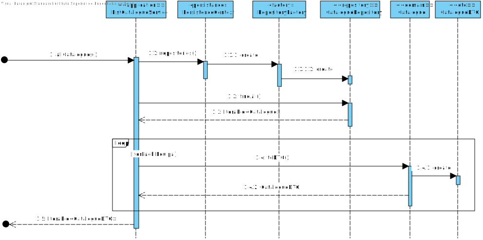
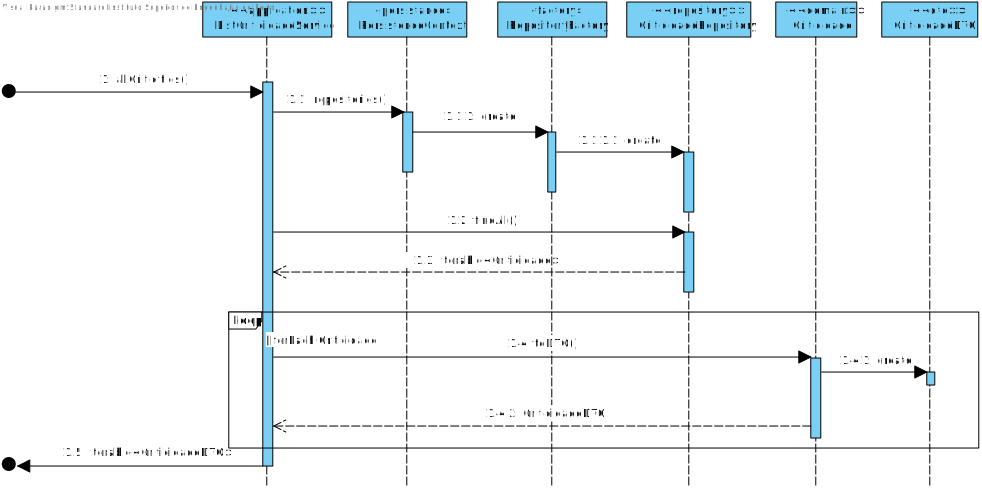

# UC 2012 - Atribuir o nivel de criticidade um catálogo de serviços
=======================================

# 1. Requisitos

**UC 2012:**  Como GSH, eu pretendo atribuir o nivel de criticidade aplicado a um catálogo de serviços.

Critérios de Aceitação / Observações :

- Deve contemplar os casos em que é necessário configurar objetivos/valores distintos dos definidos globalmente pela organização.

Informação adicional que obtive do cliente:

- [Identificador sequencial e gerado automaticamente.](https://moodle.isep.ipp.pt/mod/forum/discuss.php?d=7400)

- [Definir um ou mais colaboradores responsaveis pelo serviço.](https://moodle.isep.ipp.pt/mod/forum/discuss.php?d=7019)
  - [Com atribuição através de uma pesquisa](https://moodle.isep.ipp.pt/mod/forum/discuss.php?d=7623)

# 2. Análise

Para análise o modelo de domínio dá resposta ao requisito, não sendo assim necessário estender o mesmo. [Verificar modelo de domínio](https://bitbucket.org/1190731/lei20_21_s4_2dl_1/src/master/Modelo%20de%20Dominio.svg)

# 3. Design

## 3.1. Realização da Funcionalidade

### Atribuir Nivel de Criticidade a Catálogo de Serviços

#### ListCatalogueService_SD

#### ListCriticidadeService_SD

## 3.2. Diagrama de Classes

## 3.3. Padrões Aplicados

* Pardrão Factory - e modo a simplificar a a manipulação de diferentes repositorios foi utilizado o padrão Factory.
* Pardrão DTO - de modo a passar informação da camada de dominio para a camada de apresentação foi utilizado o padrão DTO, isolando assim o modelo de dominio da apresentação.

# 4. Implementação

# 5. Integração/Demonstração

No decorrer da implementação desta funcionalidade encontrei algumas dependencias com outras user stories, visto que o catalogo possui relações com varios colabotradores, tipos de equipa e criticidades. Porém o trabalho foi sempre bastante fluido, pois trabalhando em grupo as dependencias iam desaparecendo. 

# 6. Observações

Penso que esta funcionalidade esteja de acordo com os requerimentos do cliente. O forum demonstrou-se bastante util pois sempre que uma duvida me surgia, ou alguem já a tinha tido ou então facilmente a colocava ao cliente. Dito isto, penso que esta funcionalidade está de acordo com as informações relativas ao catalogo por parte do caderno de encargos e do o forum.
