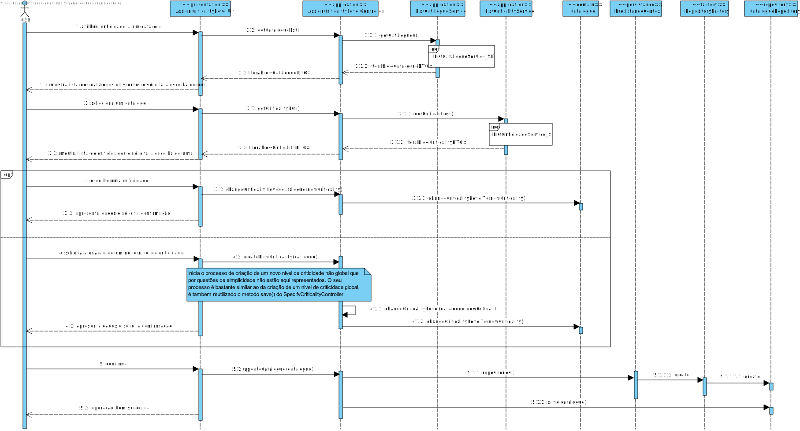

# UC 2012 - Atribuir o nivel de criticidade um catálogo de serviços
=======================================


# 1. Requisitos

**UC 2012:**  Como GSH, eu pretendo atribuir o nivel de criticidade aplicado a um catálogo de serviços.

Critérios de Aceitação / Observações :

- Deve contemplar os casos em que é necessário configurar objetivos/valores distintos dos definidos globalmente pela organização.


# 2. Análise

Para análise o modelo de domínio dá resposta ao requisito, não sendo assim necessário estender o mesmo. [Verificar modelo de domínio](https://bitbucket.org/1190731/lei20_21_s4_2dl_1/src/master/Modelo%20de%20Dominio.svg)

# 3. Design

## 3.1. Realização da Funcionalidade

### Atribuir Nivel de Criticidade a Catálogo de Serviços


#### ListCatalogueService_SD


#### ListCriticidadeService_SD


## 3.2. Diagrama de Classes

## 3.3. Padrões Aplicados

* Pardrão Factory - e modo a simplificar a a manipulação de diferentes repositorios foi utilizado o padrão Factory.
* Pardrão DTO - de modo a passar informação da camada de dominio para a camada de apresentação foi utilizado o padrão DTO, isolando assim o modelo de dominio da apresentação.

# 4. Implementação

  No decorrer desta funcionalidade é mostrada ao user uma lista das criticidades existentes na organização. Aqui o user tem a opção de escolher uma, para que esta seja posteriormente atribuida ao catalogo de serviços, ou de configurar objetivos/valores distintos dos definidos globalmente. Este processo de criação é bastante similar ao da UC2010 - EspecificarCriticidade, sendo que a unica diferença é que esta é guardada como não global.

  ```java
protected CriticalityDTO showCriticityAndChoose() {
        List<CriticalityDTO> lstCriticidade = new ArrayList<>();
        this.theController.getCriticalityLst().forEach(lstCriticidade::add);
        CriticalityDTO criticidade = null;
        int index = 1;

        System.out.printf("%n%s%n", "Lista Niveis criticidade:");
        while (index != 0) {
            for (CriticalityDTO dto : lstCriticidade)
                System.out.printf("#%d %s - %s%n", index++, dto.label, dto.valorCriticidade);
            index = Console.readInteger("Escolha uma criticidade para o catalogo (0 para criar): ");

            if (index > 0 && index - 1 < lstCriticidade.size()) {
                criticidade = lstCriticidade.get(index - 1);
                index = 0;
            } else if (index == 0) {
                criticidade = createNonGlobalCriticalityLevel();
            }
        }
        return criticidade;
    }
```
```java
    protected CriticalityDTO createNonGlobalCriticalityLevel() {
        System.out.println("\nInsira a informação necessária para a Criticidade");
        String valorCriticidade = Console.readLine("ValorCriticidade:");
        String label = Console.readLine("Label:");
        System.out.println("\n--Objetivo de Aprovação [HH:MM]--");
        String tempoMaximoA = Console.readLine("Tempo Maximo:");
        String tempoMedioA = Console.readLine("Tempo Medio:");
        System.out.println("\n--Objetivo de Resolção [HH:MM]--");
        String tempoMaximoR = Console.readLine("Tempo Maximo:");
        String tempoMedioR = Console.readLine("Tempo Maximo:");
        try {
            CriticalityDTO criticalityDTO = new CriticalityDTO((long) 0, label, valorCriticidade, tempoMaximoA, tempoMedioA, tempoMaximoR, tempoMedioR,false);

            CriticalityDTO criticidade = theController.createNonGlobalCriticalityLevel(criticalityDTO);

            System.out.println(criticidade);
            boolean answer = Console.readBoolean("A informacao esta correta?(s/n)");
            if (answer)
                return criticidade;
        } catch (final IntegrityViolationException | ConcurrencyException | IllegalArgumentException e) {
            System.out.printf("Infelizmente ocorreu um erro na aplicação, por favor tente novamente: %s%n", e.getMessage());
        }
        return null;
    }

  ```

# 5. Integração/Demonstração

Para a implementação desta funcionalidade foi necessário reorganizar os dados de um nivel de criticidade. Com isto foi possivel definir niveis de criticidade globalmente pela organização ou apenas para um catalogo, tal como o que foi pedido por parte do cliente.

# 6. Observações

Penso que esta funcionalidade esteja de acordo com os requerimentos do cliente. Com esta, passa a ser possivel atribuir um nivel de criticidade a um catalogo de serviços, sendo o nivel de criticidade um nivel definido globalmente pela organização ou não. Não foram sentidas nenhumas dependencias.
