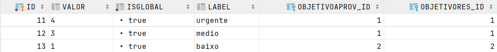

# UC 2105 - Informação relativa a níveis de criticidade (Bootstrap)
=======================================


# 1. Requisitos

Como Gestor de Projeto, eu pretendo que, para efeitos de demonstração, o sistema contemple a possibilidade de ser inicializado (bootstrap) com:

- um conjunto de níveis de criticidade e respetivos objetivos aplicados pela organização 

- a atribuição de alguns desses níveis a catálogos de serviços.

# 2. Análise

O bootstrap dos niveis de criticidade será sempre injetado antes do bootstrap dos catalogos de serviço, pois um catalogo possui niveis de criticidade.

#### Tabela Niveis Criticidade



# 3. Implementação

Para facilitar a futura alteração do bootstrap optamos por concentrar toda a informação num ficheiro XML, o que poderá também simplificar futuras integraçoes. Foram utilizados os controllers de outras user stories.

```
<?xml version="1.0"?>
<class>
    <criticality>
        <labelCriti>urgente</labelCriti>
        <criticalityValue>4</criticalityValue>
        <tempoMaximoA>00:30</tempoMaximoA>
        <tempoMedioA>00:20</tempoMedioA>
        <tempoMaximoR>03:10</tempoMaximoR>
        <tempoMedioR>02:30</tempoMedioR>
    </criticality>

    <criticality>
        <labelCriti>medio</labelCriti>
        <criticalityValue>3</criticalityValue>
        <tempoMaximoA>00:30</tempoMaximoA>
        <tempoMedioA>00:20</tempoMedioA>
        <tempoMaximoR>03:10</tempoMaximoR>
        <tempoMedioR>02:30</tempoMedioR>
    </criticality>

    <criticality>
        <labelCriti>baixo</labelCriti>
        <criticalityValue>1</criticalityValue>
        <tempoMaximoA>01:30</tempoMaximoA>
        <tempoMedioA>01:00</tempoMedioA>
        <tempoMaximoR>01:00</tempoMaximoR>
        <tempoMedioR>00:30</tempoMedioR>
    </criticality>
</class>
```

# 3. Integração/Demonstração

Não tendo dependencias foi algo rapido de implementar. Porem, no sprint anterior, era pedido que se criassem Catalogos de serviço, e visto que um catalogo possui um nivel de criticidade, o bootstrap dos mesmos ja estavam implementados. Sendo assim, esta funcionalidade é uma adaptação do que foi desenvolvido no sprint passado.

# 4. Observações

Para esta funcionalidade não foi encontrada nenhunha depenência, sendo assim facilmente implementada.


