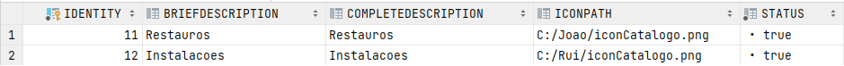
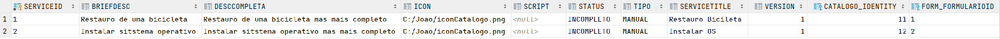

# UC 2101 - Informação relativa ao catálogo de serviços e serviços (Bootstrap)
=======================================


# 1. Requisitos

Como Gestor de Projeto, eu pretendo que, para efeitos de demonstração, o sistema contemple a possibilidade de ser inicializado (bootstrap) com alguma informação relativa ao catálogo de serviços e serviços.

# 2. Análise

Para o bootstrap dos catalogos e dos serviços foi necessário trabalhar em sincronismo com o bootraper da estrutura organica da organização. Isto porque para a criação de um catalogo é necessário que haja equipas, colaboradores e criticidades em sistema. Para este bootstrap o catalogo é criado antes do serviço, pois um serviço referencia um catalogo a que está inserido.

#### Tabela Catalogo


#### Tabela Serviço


# 3. Implementação

Para facilitar a futura alteração do bootstrap optamos por concentrar toda a informação num ficheiro XML, o que poderá também simplificar futuras integraçoes. Foram utilizados os controllers de outras user stories

```
<?xml version="1.0"?>
<class>
<class1>
    <catalogo>
        <criteriosdeAcesso>1</criteriosdeAcesso>
        <responsaveis>1</responsaveis>
        <iconCatalogo>C:/Joao/iconCatalogo.png</iconCatalogo>
        <tituloCatalogoC>Restauros</tituloCatalogoC>
        <descricaoBreveC>descricao breve restauros</descricaoBreveC>
        <descricaoCompletaC>Catalogo de restuaros</descricaoCompletaC>
        <criticidade>1</criticidade>
    </catalogo>

    <Servico>
        <Formulario>
            <fId>1</fId>
            <fnome>Formulario</fnome>
            <fscript>C:/Joao/script</fscript>
            <Atributo>
                <Alabel>Opcao</Alabel>
                <Adescricao>Qual o tipo</Adescricao>
                <Atipo>String</Atipo>
                <Aregex>[a-z]</Aregex>
                <Anome>tipoRestauro</Anome>
                <aID>1</aID>
            </Atributo>
        </Formulario>
        <descricaoBreve>Restauro de uma bicicleta</descricaoBreve>
        <descricaoCompleta>Restauro de uma bicicleta mas mais completo</descricaoCompleta>
        <ServicoID>1</ServicoID>
        <keyWords>bicileta</keyWords>
        <statusServico>INCOMPLETO</statusServico>
        <iconServico>C:/Joao/iconCatalogo.png</iconServico>
        <tituloServico>Restauro Bicileta</tituloServico>
        <catalogoS>1</catalogoS>
    </Servico>
</class1>
<class1>
<catalogo>
    <criteriosdeAcesso>1</criteriosdeAcesso>
    <responsaveis>2</responsaveis>
    <iconCatalogo>C:/Rui/iconCatalogo.png</iconCatalogo>
    <tituloCatalogoC>Instalacoes</tituloCatalogoC>
    <descricaoBreveC>descricao breve instalacoes</descricaoBreveC>
    <descricaoCompletaC>Catalogo de instalacoes</descricaoCompletaC>
    <criticidade>1</criticidade>
</catalogo>

<Servico>
    <Formulario>
        <fId>2</fId>
        <fnome>FormularioX</fnome>
        <fscript>C:/Joao/script</fscript>
        <Atributo>
            <Alabel>Label</Alabel>
            <Adescricao>Onde</Adescricao>
            <Atipo>String</Atipo>
            <Aregex>[a-z]</Aregex>
            <Anome>lugarInstalacao</Anome>
            <aID>2</aID>
        </Atributo>
    </Formulario>
    <descricaoBreve>Instalar sitstema operativo</descricaoBreve>
    <descricaoCompleta>Instalar sitstema operativo mas mais completo</descricaoCompleta>
    <ServicoID>2</ServicoID>
    <keyWords>os</keyWords>
    <statusServico>INCOMPLETO</statusServico>
    <iconServico>C:/Joao/iconCatalogo.png</iconServico>
    <tituloServico>Instalar OS</tituloServico>
    <catalogoS>2</catalogoS>
</Servico>
</class1>
</class>
```

# 3. Integração/Demonstração

Para esta use case precisei de esperar pela equipa até que todos os seviços e catalogos fossem devidamente implementados, e consequentemente, as equipas, criticidades e colaboradores. Porem, com o auxilio do xml, que demonstrou-se bastante flexivel, a funcionalidade foi sendo implementada á medida que as outras use cases iam sendo finalizadas.

# 4. Observações

Para esta funcionalidade foi necessário trabalhar em sincronização com o meu colega que estava a desenvolver o bootstrap relativo à estrutura orgânica da organização. Isto porque na criação de um calaogo, por exemplo, são necessárias equipas e colaboradores já em sistema. Infelizmente, só foi possivel a criação de um catalogo e de um serviço pois de vez em quando, na criação dos varios, a base de dados ficava sobrecarregada.   
```HibernateException : The internal connection pool has reached its maximum size and no connection is currently available```


