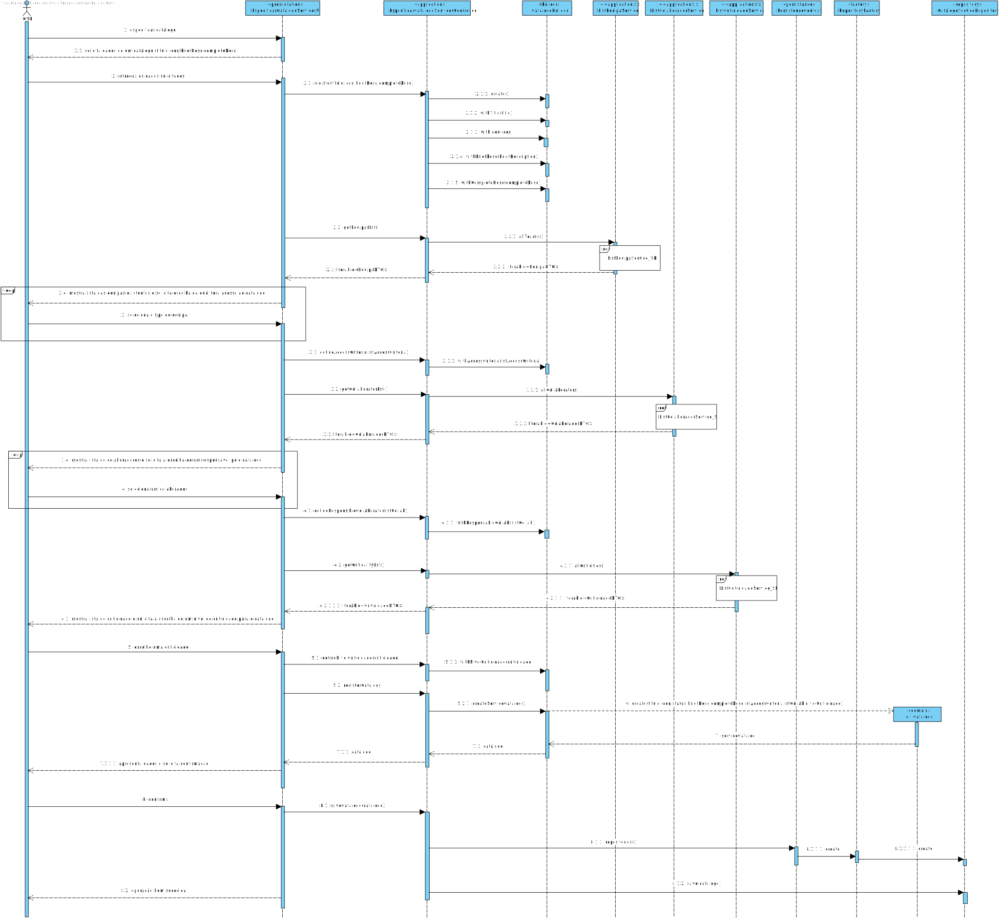
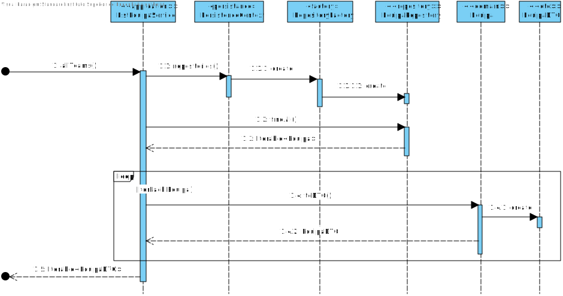
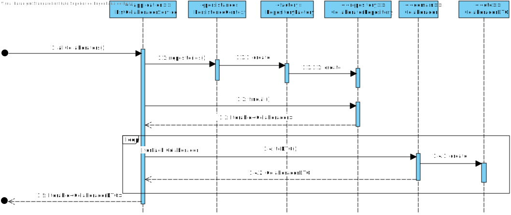
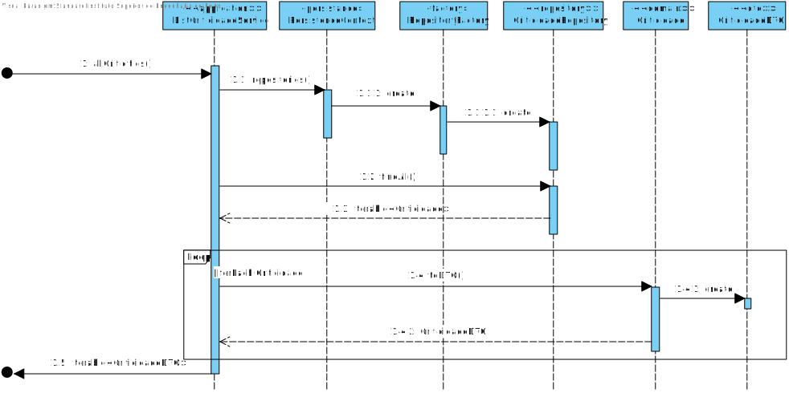

# UC 2001 - Criar catálogo de serviços
=======================================


# 1. Requisitos

**UC 2001:**  Como Gestor de Serviços de Help desk (GSH), eu pretendo criar um novo catálogo de serviços.

Critérios de Aceitação / Observações :

- Inclui indicar o colaborador responsável.

- Inclui indicar os colaboradores a quem o serviço fica disponível: uma ou mais equipas.

Informação adicional que obtive do cliente:

- [Identificador sequencial e gerado automaticamente.](https://moodle.isep.ipp.pt/mod/forum/discuss.php?d=7400)

- [Definir um ou mais colaboradores responsaveis pelo serviço.](https://moodle.isep.ipp.pt/mod/forum/discuss.php?d=7019)
  - [Com atribuição através de uma pesquisa](https://moodle.isep.ipp.pt/mod/forum/discuss.php?d=7623)


# 2. Análise

Para análise o modelo de domínio dá resposta ao requisito, não sendo assim necessário estender o mesmo. [Verificar modelo de domínio](https://bitbucket.org/1190731/lei20_21_s4_2dl_1/src/master/Modelo%20de%20Dominio.svg)

# 3. Design

## 3.1. Realização da Funcionalidade

### Criar Catalogo


#### ListEquipaService_SD


#### ListColaboradorService_SD


#### ListCriticidadeService_SD


## 3.2. Diagrama de Classes

## 3.3. Padrões Aplicados

* Pardrão Builder - Para evitar diferentes construtores para diferentes situações e para possibilitar a criação do catalogo por etapas foi usado o padrão Builder.
* Pardrão Factory - e modo a simplificar a a manipulação de diferentes repositorios foi utilizado o padrão Factory.
* Pardrão DTO - de modo a passar informação da camada de dominio para a camada de apresentação foi utilizado o padrão DTO, isolando assim o modelo de dominio da apresentação.

## 3.4. Testes 
*Nesta secção deve sistematizar como os testes foram concebidos para permitir uma correta aferição da satisfação dos requisitos.*

### TituloTest
**Teste 1:** Verificar que um titulo pode conter pontuação.

	@Test
    public void ensureTitleCanHavePontuation() {
        System.out.println("Title can have pontuation");
        Titulo result = new Titulo("É um bom titulo!");
        String expected = "É um bom titulo!";
        assertEquals(result.toString(),expected);
    }

**Teste 2:** Verificar que um titulo pode conter acentos.

    @Test
    public void ensureTitleCanHaveAccent() {
        System.out.println("Title can have accents");
        Titulo result = new Titulo("É um bom titulo");
        String expected = "É um bom titulo";
        assertEquals(result.toString(),expected);
    }

**Teste 3:** Verificar que um titulo não pode ser muito extenso.

    @Test
    public void ensureTitleCannotBeToLong() {
        System.out.println("Title can not be too long");
        assertThrows(IllegalArgumentException.class,() -> new Titulo("Este titulo é demasiado grande"));
    }	

**Teste 4:** Verificar que um titulo pode ser vazio.

    @Test
    public void ensureTitleCannotBeEmpty() {
        System.out.println("Title can not be empty");
        assertThrows(IllegalArgumentException.class,() -> new Titulo(" "));
    }

**Teste 5:** Verificar que um titulo não pode ser nulo.

    @Test
    public void ensureTitleCannotBeNull() {
        System.out.println("Title can not be null");
        assertThrows(IllegalArgumentException.class,() -> new Titulo(null));
    }

### DescricaoBreveTest
**Teste 1:** Verificar que  uma descrição breve não pode ser muito extensa.

    @Test
    public void ensureDescriptionCannotBeToLong() {
        System.out.println("Brief description can not be too long");
        assertThrows(IllegalArgumentException.class,() -> new DescricaoBreve("Esta descrição breve é um bocado longa demais, pois se alguem se alongar demasiado numa descrição" +
                "breve, ela deixa de ser breve"));
    }

**Teste 2:** Verificar que  uma descrição breve não pode ser vazia.

    @Test
    public void ensureDescriptionCannotBeEmpty() {
        System.out.println("Brief bescription can not be empty");
        assertThrows(IllegalArgumentException.class,() -> new DescricaoBreve(" "));
    }

**Teste 3:** Verificar que  uma descrição breve não pode ser nula.

    @Test
    public void ensureDescriptionCannotBeNull() {
        System.out.println("Brief description can not be null");
        assertThrows(IllegalArgumentException.class,() -> new DescricaoBreve(null));
    }	

### DescricaoCompletaTest
**Teste 1:** Verificar que  uma descrição completa não pode ser vazia.

    @Test
    public void ensureDescriptionCannotBeEmpty() {
        System.out.println("Complete description can not be empty");
        assertThrows(IllegalArgumentException.class,() -> new DescricaoCompleta(" "));
    }


**Teste 1:** Verificar que  uma descrição completa não pode ser nula.

    @Test
    public void ensureDescriptionCannotBeNull() {
        System.out.println("Complete description can not be null");
        assertThrows(IllegalArgumentException.class,() -> new DescricaoCompleta(null));
    }

### IconTest
**Teste 1:** Verificar que o path de um icon não pode ser vazia.

    @Test
    public void ensureIconCannotBeEmpty() {
        System.out.println("Icon can not be empty");
        assertThrows(IllegalArgumentException.class,() -> new Icon(" "));
    }


**Teste 2:** Verificar que o path de um icon não pode ser nula.

    @Test
    public void ensureIconCannotBeNull() {
        System.out.println("Icon can not be null");
        assertThrows(IllegalArgumentException.class,() -> new Icon(null));
    }	

### CatalogoTest
**Teste 1:** Verificar que a lista de criterios de acesso não pode ser vazia, e consequentemente a lista de colaboradores responsaveis.

    @Test
    public void ensureCatalogCriteriaAccessIsNotNull() {
        final Set<Colaborador> responsableCollabs = new HashSet<>();
        responsableCollabs.add(null); //add colaborador
        assertThrows(IllegalArgumentException.class,() -> new Catalogo(new Titulo("Titulo"), new Icon("C:/icon.png"),new DescricaoBreve("descição")
        , new DescricaoCompleta("descição completa"), responsableCollabs ,null, null));
    }


**Teste 2:** Verificar que a lista de criterios de acesso não pode ser nula, e consequentemente a lista de colaboradores responsaveis.

    @Test
    public void ensureCatalogCriteriaAccessIsNotEmpty() {
        final Set<Colaborador> responsableCollabs = new HashSet<>();
        responsableCollabs.add(null); //add colaborador
        final Set<Equipa> accessCriteria = new HashSet<>();
        assertThrows(IllegalArgumentException.class,() -> new Catalogo(new Titulo("Titulo"), new Icon("C:/icon.png"),new DescricaoBreve("descição")
                , new DescricaoCompleta("descição completa"), responsableCollabs ,accessCriteria, null));
    }

# 4. Implementação

#### Catalogo Builder

```
public class CatalogBuilder implements DomainFactory<Catalogo> {
    private Long identity;
    private Titulo titulo;
    private Icon icon;
    private DescricaoBreve briefDesc;
    private DescricaoCompleta completeDesc;
    private final Set<Colaborador> responsableCollabs = new HashSet<>();
    private final Set<Equipa> accessCriteria = new HashSet<>();
    private Criticidade nivelCriticidade;

    ...

     @Override
    public Catalogo build() {
        if(identity == null)
            return new Catalogo(titulo,icon,briefDesc,completeDesc,responsableCollabs,accessCriteria,nivelCriticidade);
        return new Catalogo(identity,titulo,icon,briefDesc,completeDesc,responsableCollabs,accessCriteria,nivelCriticidade);
    }
 ```  

 #### Catalogo DTO 

 ```
@DTO
public class CatalogoDTO {
    public Long identity;
    public String catalogTitle;
    public String icon;
    public String briefDesc;
    public String completeDesc;
    public Set<EquipaDTO> accessCriteria = new HashSet<>();
    public Set<ColaboradorDTO> responsableCollabs = new HashSet<>();
    public CriticidadeDTO nivelCriticidade;


    public CatalogoDTO(Long identity, String catalogTitle, String icon,
                       String briefDesc, String completeDesc, Set<Colaborador> responsableCollabs, Set<Equipa> accessCriteria, Criticidade nivelCriticidade) {

        this.identity = identity;
        this.catalogTitle = catalogTitle;
        this.icon = icon;
        this.briefDesc = briefDesc;
        this.completeDesc = completeDesc;
        responsableCollabs.forEach(a -> this.responsableCollabs.add(a.toDTO()));
        accessCriteria.forEach(a -> this.accessCriteria.add(a.toDTO()));
        this.nivelCriticidade = nivelCriticidade.toDTO();
    }

```


 #### Catalogo DTO Parser 
 
```
public class CatalogoDTOParser implements DTOParser<CatalogoDTO, Catalogo> {

    public CatalogoDTOParser() {
        //empty
    }

    @Override
    public Catalogo valueOf(CatalogoDTO dto) {
        CatalogBuilder builder = new CatalogBuilder();

        final Set<Equipa> accessCriteria = new HashSet<>();
        dto.accessCriteria.forEach( a -> accessCriteria.add(new EquipaDTOParser().valueOf(a)));

        final Set<Colaborador> lstResponsable = new HashSet<>();
        dto.responsableCollabs.forEach( a -> lstResponsable.add(new ColaboradorDTOParser().valueOf(a)));

        return builder.withTitle(dto.catalogTitle).withIcon(dto.icon)
                .withBriefDesc(dto.briefDesc).withCompleteDesc(dto.completeDesc)
                .withResponsableCollabs(lstResponsable).withAccessCriteria(accessCriteria).withIdentity(dto.identity).withNivelCriticidade(new CriticidadeDTOParser().valueOf(dto.nivelCriticidade)).build();
    }
```

# 5. Integração/Demonstração

No decorrer da implementação desta funcionalidade encontrei algumas dependencias com outras user stories, visto que o catalogo possui relações com varios colabotradores, tipos de equipa e criticidades. Porém o trabalho foi sempre bastante fluido, pois trabalhando em grupo as dependencias iam desaparecendo. 

# 6. Observações

Penso que esta funcionalidade esteja de acordo com os requerimentos do cliente. O forum demonstrou-se bastante util pois sempre que uma duvida me surgia, ou alguem já a tinha tido ou então facilmente a colocava ao cliente. Dito isto, penso que esta funcionalidade está de acordo com as informações relativas ao catalogo por parte do caderno de encargos e do o forum.
