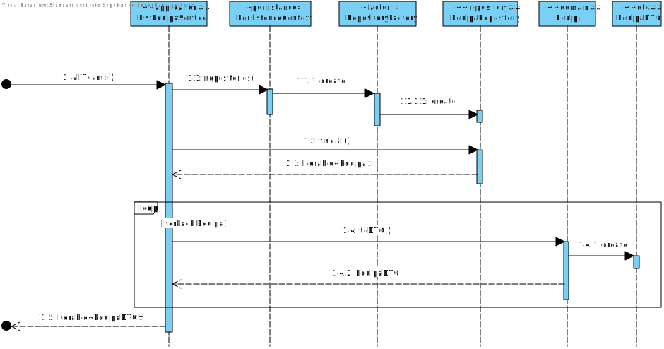
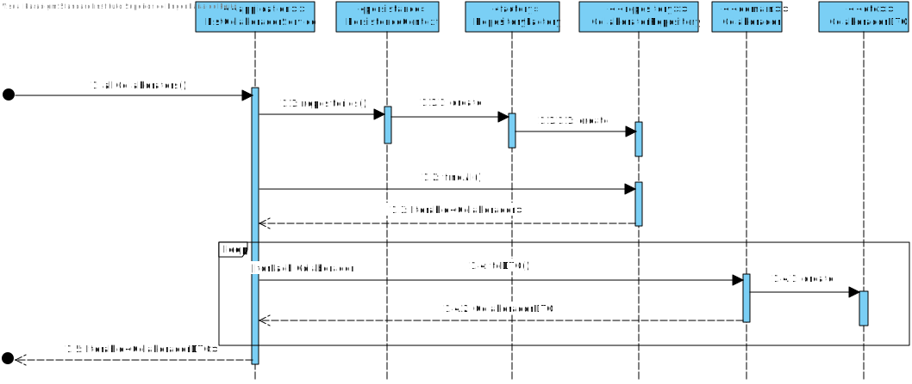

# UC 2001 - Criar catálogo de serviços
=======================================

# 1. Requisitos

**UC 2001:**  Como Gestor de Serviços de Help desk (GSH), eu pretendo criar um novo catálogo de serviços.

Informação adicional que obtive do cliente:

- [Identificador sequencial e gerado automaticamente.](https://moodle.isep.ipp.pt/mod/forum/discuss.php?d=7400)

- [Definir um ou mais colaboradores responsaveis pelo serviço.](https://moodle.isep.ipp.pt/mod/forum/discuss.php?d=7019)
  - [Com atribuição através de uma pesquisa](https://moodle.isep.ipp.pt/mod/forum/discuss.php?d=7623)

# 2. Análise

Para análise o modelo de domínio dá resposta ao requisito, não sendo assim necessário estender o mesmo. [Verificar modelo de domínio](mdURL)

# 3. Design

*Nesta secção a equipa deve descrever o design adotado para satisfazer a funcionalidade. Entre outros, a equipa deve apresentar diagrama(s) de realização da funcionalidade, diagrama(s) de classes, identificação de padrões aplicados e quais foram os principais testes especificados para validar a funcionalidade.*

*Para além das secções sugeridas, podem ser incluídas outras.*

## 3.1. Realização da Funcionalidade

*Nesta secção deve apresentar e descrever o fluxo/sequência que permite realizar a funcionalidade.*

Para esta funcionalidade começamos por pedir ao utilizador que insira seguintes valores como o titulo, o icon, uma descrição breve e outra mais completa. O UI transmite esses dados ao Controller que por sua vez os manda para o Builer.

### ListEquipaService_SD

### ListColaboradorService_SD

### ListCriticidadeService_SD

## 3.2. Diagrama de Classes

*Nesta secção deve apresentar e descrever as principais classes envolvidas na realização da funcionalidade.*

## 3.3. Padrões Aplicados

* Para evitar diferentes construtores para diferentes situações e para possibilitar a criação do catalogo por etapas foi usado o padrão Builder.
* De modo a simplificar a a manipulação de diferentes repositorios foi utilizado o padrão Factory.

## 3.4. Testes 
*Nesta secção deve sistematizar como os testes foram concebidos para permitir uma correta aferição da satisfação dos requisitos.*

**Teste 1:** Verificar que não é possível criar uma instância da classe Exemplo com valores nulos.

	@Test(expected = IllegalArgumentException.class)
		public void ensureNullIsNotAllowed() {
		Exemplo instance = new Exemplo(null, null);
	}

# 4. Implementação

*Nesta secção a equipa deve providenciar, se necessário, algumas evidências de que a implementação está em conformidade com o design efetuado. Para além disso, deve mencionar/descrever a existência de outros ficheiros (e.g. de configuração) relevantes e destacar commits relevantes;*

*Recomenda-se que organize este conteúdo por subsecções.*

# 5. Integração/Demonstração

*Nesta secção a equipa deve descrever os esforços realizados no sentido de integrar a funcionalidade desenvolvida com as restantes funcionalidades do sistema.*

# 6. Observações

*Nesta secção sugere-se que a equipa apresente uma perspetiva critica sobre o trabalho desenvolvido apontando, por exemplo, outras alternativas e ou trabalhos futuros relacionados.*

