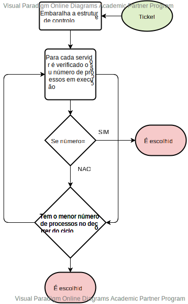

# US4072
=======================================


# 1. Requisitos

Como Gestor de Projeto, eu pretendo que seja desenvolvido e integrado no Motor de Fluxos de Atividades  algoritmos que distribuam a realização de tarefas automáticas pelas diversas instâncias do Executor de Tarefas Automáticas existentes na infraestrutura instalada.

O uso ou não de um destes algoritmo e qual o algoritmo a usar deve ser configurável no sistema.


# 3. Design


## 3.1. Realização da Funcionalidade



# 4. Implementação
 ```
public Ticket RRAutomaticTask(Ticket ticket) {

        String selected = "";
        try {
            if (ticket.workflow().getFirstIncompleteTask() instanceof TicketAutomaticTask) {
                selected = RRassignServer();
                TcpExecuterClient client = new TcpExecuterClient();
                if (client.startConnection(selected)) {
                    client.executeAutomaticTask(ticket);
                    client.stopConnection();
                    serverQueueMap.put(selected, serverQueueMap.get(selected) - 1);
                }
            }


        } catch (IOException e) {
            System.out.println("An error ocorred");
        }

        return ticket;
    }

    public synchronized String RRassignServer() {

        String theChosenOne = "";
        int theChosenOneN = -1;
        List<String> serverList = new LinkedList<>();
        serverList.add("172.17.0.3");
        serverList.add("172.17.0.4");
        serverList.add("172.17.0.5");
        serverList.add("172.17.0.6");

        //Adiciona o server ao mapa caso este não esteja lá
        for (String server : serverList) {
            if (!serverQueueMap.containsKey(server))
                serverQueueMap.put(server, 0);
        }

        //Verifica a disponibilidade e carga de cada uma das instancias
        for (String server : serverQueueMap.keySet()) {
            if (serverQueueMap.get(server) == 0) {
                serverQueueMap.put(server, serverQueueMap.get(server) + 1);
                return server;
            }
            if (serverQueueMap.get(server) < theChosenOneN) {
                theChosenOne = server;
                theChosenOneN = serverQueueMap.get(server);
            }
        }

        serverQueueMap.put(theChosenOne, serverQueueMap.get(theChosenOne) + 1);
        return theChosenOne;
    }
 
 ```

# 5. Integração/Demonstração


