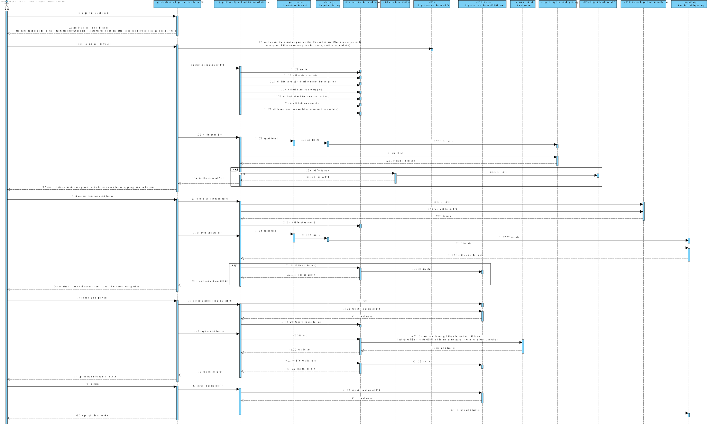

# UC 2051 - Especificar Colaborador
=======================================

# 1. Requisitos

**UC 2051:**  Como Responsável de Recursos Humanos (RRH), eu pretendo proceder à especificação de um novo colaborador de modo a que este possa, posteriormente, aceder e usar o sistema.

Critérios de Aceitação / Observações :

- Deve contemplar a associação a uma ou mais equipas.

- Devem reutilizar o componente de gestão de utilizadores disponibilizado em EAPLI.

Informação adicional que obtive do cliente:

- [Regras de negócio adicionais.](https://moodle.isep.ipp.pt/mod/forum/discuss.php?d=7561)

# 2. Análise

Para análise o modelo de domínio dá resposta ao requisito, não sendo assim necessário estender o mesmo. [Verificar modelo de domínio](https://bitbucket.org/1190731/lei20_21_s4_2dl_1/src/master/Modelo%20de%20Dominio.svg)

# 3. Design

## 3.1. Realização da Funcionalidade

### Especificar Colaborador

## 3.2. Diagrama de Classes

## 3.3. Padrões Aplicados

* Pardrão Builder - Para evitar diferentes construtores para diferentes situações e para possibilitar a criação do catalogo por etapas foi usado o padrão Builder.
* Pardrão Factory - e modo a simplificar a a manipulação de diferentes repositorios foi utilizado o padrão Factory.
* Pardrão DTO - de modo a passar informação da camada de dominio para a camada de apresentação foi utilizado o padrão DTO, isolando assim o modelo de dominio da apresentação.

## 3.4. Testes 

**Teste 1:** Verifica que o nome completo tem pelo menos 3 nomes, nao pode estar vazio ou ser nulo.

	@Test
    public void teste(){
        assertEquals(nomeCompleto, new NomeCompleto("José Miguel Freitas"));
        assertNotEquals(nomeCompleto, new NomeCompleto("José Castelo Branco"));
        assertThrows(IllegalArgumentException.class,() -> new NomeCompleto("José Freitas"));
        assertThrows(IllegalArgumentException.class,() -> new NomeCompleto(""));
        assertThrows(IllegalArgumentException.class,() -> new NomeCompleto(null));
    }

**Teste 2:** Verifica que a alcunha pode conter maisculas, nao é nula nem vazia

	@Test
    public void test(){
        assertEquals(alcunha, new Alcunha("Tomy"));
        assertNotEquals(alcunha, new Alcunha("Johny"));
        assertThrows(IllegalArgumentException.class,() -> new Alcunha(""));
        assertThrows(IllegalArgumentException.class,() -> new Alcunha(null));
    }

**Teste 3:** Verifica que o andar nao tem mais de 4 digitos, que só contem caracteres numericos, não é vazio nem nulo

    @Test
    public void test(){
        assertEquals(andar,new Andar("3"));
        assertNotEquals(andar,new Andar("4"));
        assertThrows(IllegalArgumentException.class,() -> new Andar("1000000"));
        assertThrows(IllegalArgumentException.class,() -> new Andar("a"));
        assertThrows(IllegalArgumentException.class,() -> new Andar(""));
        assertThrows(IllegalArgumentException.class,() -> new Andar(null));
    }

**Teste 4:** Verifica que o codPostal cumpre o formato especifico [XXXX-XXX], não é vazio nem nulo

    @Test
    public void test(){
        assertEquals(codPostal,new CodPostal("4953-123"));
        assertNotEquals(codPostal,new CodPostal("3212-123"));
        assertThrows(IllegalArgumentException.class,() -> new CodPostal("4324-23"));
        assertThrows(IllegalArgumentException.class,() -> new CodPostal("a"));
        assertThrows(IllegalArgumentException.class,() -> new CodPostal(""));
        assertThrows(IllegalArgumentException.class,() -> new CodPostal(null));
    }

**Teste 5:** Verifica que o contacto nao tem mais ou menos do que 9 números,que só contem caracteres numericos, não é vazio nem nulo

    @Test
    public void test(){
        assertEquals(contacto, new Contacto("921234567"));
        assertNotEquals(contacto, new Contacto("921234565"));
        assertThrows(IllegalArgumentException.class,() -> new Contacto("9212345612"));
        assertThrows(IllegalArgumentException.class,() -> new Contacto("92123456"));
        assertThrows(IllegalArgumentException.class,() -> new Contacto("a"));
        assertThrows(IllegalArgumentException.class,() -> new Contacto(""));
        assertThrows(IllegalArgumentException.class,() -> new Contacto(null));
    }

**Teste 6:** Verifica que a data de nascimento cumpre o formato especificado [DD/MM/AAAA], o dia nao é maior que 31, o mes nao é maior que 12, não é vazio nem nulo

    @Test
    public void test(){
        assertEquals(dataDeNascimento, new DataDeNascimento("12/12/1999"));
        assertNotEquals(dataDeNascimento, new DataDeNascimento("12/12/2000"));
        assertThrows(IllegalArgumentException.class,() -> new DataDeNascimento("13/12/200"));
        assertThrows(IllegalArgumentException.class,() -> new DataDeNascimento("32/12/2000"));
        assertThrows(IllegalArgumentException.class,() -> new DataDeNascimento("13/13/2000"));
        assertThrows(IllegalArgumentException.class,() -> new DataDeNascimento("a"));
        assertThrows(IllegalArgumentException.class,() -> new DataDeNascimento(""));
        assertThrows(IllegalArgumentException.class,() -> new DataDeNascimento(null));
    }

**Teste 7:** Verifica que o emailInstuticional cumpre o formato e contem certos caracteres (ex:@), não é vazio nem nulo

    @Test
    public void test(){
        assertEquals(email, new EmailInstitucional("tomy@gmail.com"));
        assertNotEquals(email, new EmailInstitucional("tiago@gmail.com"));
        assertThrows(IllegalArgumentException.class,() -> new EmailInstitucional("tiago@gmail"));
        assertThrows(IllegalArgumentException.class,() -> new EmailInstitucional("a"));
        assertThrows(IllegalArgumentException.class,() -> new EmailInstitucional(""));
        assertThrows(IllegalArgumentException.class,() -> new EmailInstitucional(null));
    }

**Teste 8:** Verifica que a localização não é vazio nem nulo

    @Test
    public void test(){
        assertEquals(localizacao,new Localizacao("Viana do Castelo"));
        assertNotEquals(localizacao,new Localizacao("Porto"));
        assertThrows(IllegalArgumentException.class,() -> new Localizacao(""));
        assertThrows(IllegalArgumentException.class,() -> new Localizacao(null));
    }

**Teste 9:** Verifica que a localização não é vazio nem nulo

    @Test
    public void test(){
        assertEquals(localizacao,new Localizacao("Viana do Castelo"));
        assertNotEquals(localizacao,new Localizacao("Porto"));
        assertThrows(IllegalArgumentException.class,() -> new Localizacao(""));
        assertThrows(IllegalArgumentException.class,() -> new Localizacao(null));
    }

**Teste 10:** Verifica que o número Mecanográfico nao tem mais que 6 digitos, que só contem caracteres numericos, não é vazio nem nulo

    @Test
    public void test(){
        assertEquals(numMec,new NumeroMecanografico("123456"));
        assertNotEquals(numMec,new NumeroMecanografico("12345"));
        assertThrows(IllegalArgumentException.class,() -> new NumeroMecanografico("1234567"));
        assertThrows(IllegalArgumentException.class,() -> new NumeroMecanografico("a"));
        assertThrows(IllegalArgumentException.class,() -> new NumeroMecanografico(""));
        assertThrows(IllegalArgumentException.class,() -> new NumeroMecanografico(null));
    }

**Teste 11:** Verifica que o número da Porta nao tem mais que 4 digitos, que só contem caracteres numericos, não é vazio nem nulo

        @Test
    public void teste(){
        assertEquals(numPorta,new NumPorta("2"));
        assertNotEquals(numPorta,new NumPorta("20"));
        assertThrows(IllegalArgumentException.class,() -> new NumPorta("2000000"));
        assertThrows(IllegalArgumentException.class,() -> new NumPorta("a"));
        assertThrows(IllegalArgumentException.class,() -> new NumPorta(""));
        assertThrows(IllegalArgumentException.class,() -> new NumPorta(null));
    }

**Teste 12:** Verifica que a rua, não é vazia nem nulo

    @Test
    public void test(){
        assertEquals(rua,new Rua("Rua das Vieiras"));
        assertNotEquals(rua,new Rua("Rua do Manuel"));
        assertThrows(IllegalArgumentException.class,() -> new Rua(""));
        assertThrows(IllegalArgumentException.class,() -> new Rua(null));
    }

**Teste 13:** Verifica que a designação da função não é vazia nem nulo

    @Test
    public void test(){
        assertEquals(desig,  new Designacao("lavar janelas"));
        assertNotEquals(desig,  new Designacao("lavar portas"));
        assertThrows(IllegalArgumentException.class,() -> new Designacao(""));
        assertThrows(IllegalArgumentException.class,() -> new Designacao(null));
    }

**Teste 14:** Verifica que a os parâmetros da morada não estao vazios

    @Test
    public void test(){
        assertEquals(morada,new Morada("Rua Galego","2","3","Viana do Castelo","4953-231"));
        assertNotEquals(morada,new Morada("Rua dos Galego","2","3","Viana do Castelo","4953-231"));
        assertThrows(IllegalArgumentException.class,() -> new Morada("","","","",""));
    }

# 4. Implementação

### Colaborador Builder
	public class ColaboradorBuilder implements DomainFactory<Colaborador>{
		private Morada morada;
		private Contacto contacto;
		private NomeCompleto nomeCompleto;
		private EmailInstitucional email;
		private NumeroMecanografico mNumber;
		private Alcunha alcunha;
		private DataDeNascimento dataDeNascimento;

		private Funcao funcao;
		private Colaborador supervisor;

		...

		@Override
		public Colaborador build() {
			return new Colaborador(morada, contacto, nomeCompleto,email,mNumber, alcunha,dataDeNascimento,funcao,supervisor);
		}

### Colaborador DTO

	@DTO
	public class ColaboradorDTO {
    	public String rua;
    	public String numPorta;
    	public String andar;
    	public String localizacao;
    	public String codPostal;
    	public String contacto;
    	public String nomeCompleto;
    	public String email;
	    public String mNumber;
    	public String alcunha;
    	public String dataDeNascimento;
    	public String designacao;
    	public String IDfuncao;
    	public String mSupervisor;

    	public ColaboradorDTO(String rua, String numPorta, String andar, 	String localizacao, String codPostal, String contacto, String nomeCompleto, String email, String mNumber, String alcunha, String dataDeNascimento) {
        this.rua = rua;
        this.numPorta = numPorta;
        this.andar = andar;
        this.localizacao = localizacao;
        this.codPostal = codPostal;
        this.contacto = contacto;
        this.nomeCompleto = nomeCompleto;
        this.email = email;
        this.mNumber = mNumber;
        this.alcunha = alcunha;
        this.dataDeNascimento = dataDeNascimento;
    }

### Colaborador DTO Parser
	public class ColaboradorDTOParser implements DTOParser<ColaboradorDTO, Colaborador> {

    final CollaboratorRepository collabRepo = PersistenceContext.repositories().collaborators();

    @Override
    public Colaborador valueOf(ColaboradorDTO dto) {
        ColaboradorBuilder colaboradorBuilder = new ColaboradorBuilder();
        if (dto.mSupervisor!=null)
            return colaboradorBuilder.withAddress(dto.rua,dto.numPorta,dto.andar,dto.localizacao,dto.codPostal).withContact(dto.contacto).withFullName(dto.nomeCompleto)
                .withInstitutionalEmail(dto.email).withMecanoGraphicNumber(dto.mNumber).withNickname(dto.alcunha).withDateOfBirth(dto.dataDeNascimento).withFunction(dto.IDfuncao,dto.designacao).build();

        final CollaboratorRepository collabRepo = PersistenceContext.repositories().collaborators();
        Optional<Colaborador> supervisor = collabRepo.ofIdentity(new NumeroMecanografico(dto.mSupervisor));
        return colaboradorBuilder.withAddress(dto.rua,dto.numPorta,dto.andar,dto.localizacao,dto.codPostal).withContact(dto.contacto).withFullName(dto.nomeCompleto)
                .withInstitutionalEmail(dto.email).withMecanoGraphicNumber(dto.mNumber).withNickname(dto.alcunha).withDateOfBirth(dto.dataDeNascimento)
                .withFunction(dto.IDfuncao,dto.designacao).withSupervisor(supervisor.get()).build();
    }

### Funcao Builder

	public class FuncaoBuilder  implements DomainFactory<Funcao> {
		private Designacao designacao;
		private IdFuncao idFuncao;

		@Override
		public Funcao build(){
			return new Funcao(idFuncao,designacao);
		}

		...

		public class FuncaoDTO {
			public String designacao;
			public String IdFuncao;

			public FuncaoDTO(String idFuncao, String designacao) {
				this.designacao = designacao;
				this.IdFuncao = idFuncao;
			}

### Funcao DTO
	@DTO
	public class FuncaoDTO {
		public String designacao;
		public String IdFuncao;

		public FuncaoDTO(String idFuncao, String designacao) {
			this.designacao = designacao;
			this.IdFuncao = idFuncao;
		}

### Funcao DTO Parser
	public class FuncaoDTOParser implements DTOParser<FuncaoDTO, Funcao> {
    @Override
    public Funcao valueOf(FuncaoDTO dto) {
        FuncaoBuilder funcaoBuilder = new FuncaoBuilder();
        return funcaoBuilder.withIdFuncao(dto.IdFuncao).withDesignacao(dto.designacao).build();
    }

# 5. Integração/Demonstração

No decorrer da implementação desta funcionalidade encontrei alguns problemas a relacionar tabelas em jpa, e a guardar certos valores na base de dados. De resto o trabalho correu como esperado. 

# 6. Observações

Esta funcionaliade encotra-se de acordo com os requesitos, o enunciado forneceu algumas regras de negócio e o fórum suplementou as que estavam por esclarecer.

