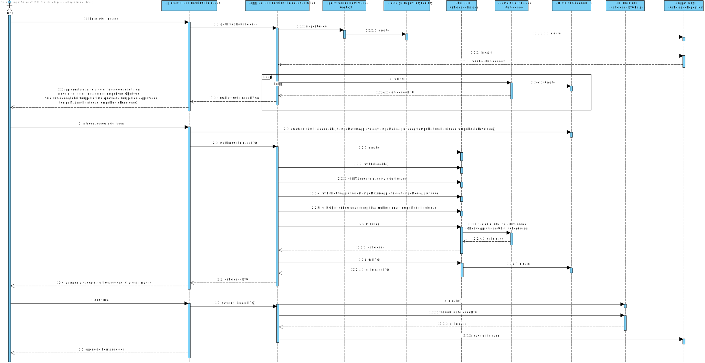

# UC 2051 - Especificar Colaborador
=======================================

# 1. Requisitos

**UC 2051:**  Como GSH, eu pretendo definir os niveis de criticidade e respetivos objetivos aplicados na organização para definição de SLAs.

# 2. Análise

Para análise o modelo de domínio dá resposta ao requisito, não sendo assim necessário estender o mesmo. [Verificar modelo de domínio](https://bitbucket.org/1190731/lei20_21_s4_2dl_1/src/master/Modelo%20de%20Dominio.svg)

# 3. Design

## 3.1. Realização da Funcionalidade

### Especificar Criticidade

## 3.2. Diagrama de Classes

## 3.3. Padrões Aplicados

* Pardrão Builder - Para evitar diferentes construtores para diferentes situações e para possibilitar a criação do catalogo por etapas foi usado o padrão Builder.
* Pardrão Factory - e modo a simplificar a a manipulação de diferentes repositorios foi utilizado o padrão Factory.
* Pardrão DTO - de modo a passar informação da camada de dominio para a camada de apresentação foi utilizado o padrão DTO, isolando assim o modelo de dominio da apresentação.

## 3.4. Testes 

**Teste 1:** Verifica que o label nao tem mais que 50 caracteres, nao pode estar vazio ou ser nulo.

	@Test
    public void test(){
        assertEquals(label, new Label("Label da Criticidade"));
        assertNotEquals(label, new Label("Nao e Label da Criticidade"));
        assertThrows(IllegalArgumentException.class,() -> new Label("Um label não pode ser longo demais pois a um certo tamanhao dei" +
                "xa de ser intuitivo"));
        assertThrows(IllegalArgumentException.class,() -> new Label(""));
        assertThrows(IllegalArgumentException.class,() -> new Label(null));
    }

**Teste 2:** Verifica que o valor da Criticidade é um valor numérico, nao é nulo nem está vazio

	@Test
    public void test(){
        assertEquals(valorCriticidade, new ValorCriticidade("1"));
        assertNotEquals(valorCriticidade, new ValorCriticidade("2"));
        assertThrows(IllegalArgumentException.class,() -> new ValorCriticidade("a"));
        assertThrows(IllegalArgumentException.class,() -> new ValorCriticidade(""));
        assertThrows(IllegalArgumentException.class,() -> new ValorCriticidade(null));
    }

**Teste 3:** Verifica que o tempo maximo e médio do Objetivo de aprovação cumprem o formato especificado,  que tanto as horas como os minutos nao excedam os valores maximos (24 e 60 respetivamente) e que os referidos parametros nao se encontram vazios 

    @Test
    public void test(){
        assertEquals(objetivoDeAprovacao, new ObjetivoDeAprovacao("02:40","02:10"));
        assertNotEquals(objetivoDeAprovacao, new ObjetivoDeAprovacao("02:40","02:00"));
        assertThrows(IllegalArgumentException.class,() -> new ObjetivoDeAprovacao("",""));
        assertThrows(IllegalArgumentException.class,() -> new ObjetivoDeResolucao("25:40","02:10"));
        assertThrows(IllegalArgumentException.class,() -> new ObjetivoDeResolucao("2:61","02:10"));
    }

**Teste 4:** Verifica que o tempo maximo e médio do Objetivo de resolução cumprem o formato especificado,  que tanto as horas como os minutos nao excedam os valores maximos (24 e 60 respetivamente) e que os referidos parametros nao se encontram vazios 

    @Test
    public void test(){
        assertEquals(objetivoDeResolucao, new ObjetivoDeResolucao("02:40","02:10"));
        assertNotEquals(objetivoDeResolucao, new ObjetivoDeResolucao("02:40","02:00"));
        assertThrows(IllegalArgumentException.class,() -> new ObjetivoDeResolucao("",""));
        assertThrows(IllegalArgumentException.class,() -> new ObjetivoDeResolucao("25:40","02:10"));
        assertThrows(IllegalArgumentException.class,() -> new ObjetivoDeResolucao("2:61","02:10"));
    }

# 4. Implementação

### Criticidade Builder
	public class CriticidadeBuilder implements DomainFactory<Criticidade>{
    private ValorCriticidade valorCriticidade;
    private Label label;
    private ObjetivoDeResolucao objetivoDeResolucao;
    private ObjetivoDeAprovacao objetivoDeAprovacao;

		...

		@Override
		public Colaborador build() {
			return new Colaborador(morada, contacto, nomeCompleto,email,mNumber, alcunha,dataDeNascimento,funcao,supervisor);
		}

### Criticidade DTO

	@DTO
    public class CriticidadeDTO {
        public String label;
        public String valorCriticidade;
        public String tempoMaximoA;
        public String tempoMedioA;
        public String tempoMaximoR;
        public String tempoMedioR;

        public CriticidadeDTO(String label, String valorCriticidade, String tempoMaximoA, String tempoMedioA, String tempoMaximoR, String tempoMedioR) {
            this.label = label;
            this.valorCriticidade = valorCriticidade;
            this.tempoMaximoA = tempoMaximoA;
            this.tempoMedioA = tempoMedioA;
            this.tempoMaximoR = tempoMaximoR;
            this.tempoMedioR = tempoMedioR;
        }
        ...

### Criticidade DTO Parser
	public class CriticidadeDTOParser implements DTOParser<CriticidadeDTO, Criticidade> {

    @Override
    public Criticidade valueOf(final CriticidadeDTO dto) {
        CriticidadeBuilder criticidadeBuilder = new CriticidadeBuilder();
        return criticidadeBuilder.withLabel(dto.label).withValorCriticidade(dto.valorCriticidade).withObjetivoDeAprovacao(dto.tempoMaximoA,dto.tempoMedioA)
                .withObjetivoDeResolucao(dto.tempoMaximoR,dto.tempoMedioR).build();
    }
}

# 5. Integração/Demonstração

No decorrer da implementação desta funcionalidade encontrei alguns problemas a relacionar tabelas em jpa, devido a herença entre certas classes.

# 6. Observações

Esta funcionaliade encotra-se de acordo com os requesitos, o enunciado as regras de negócio.

