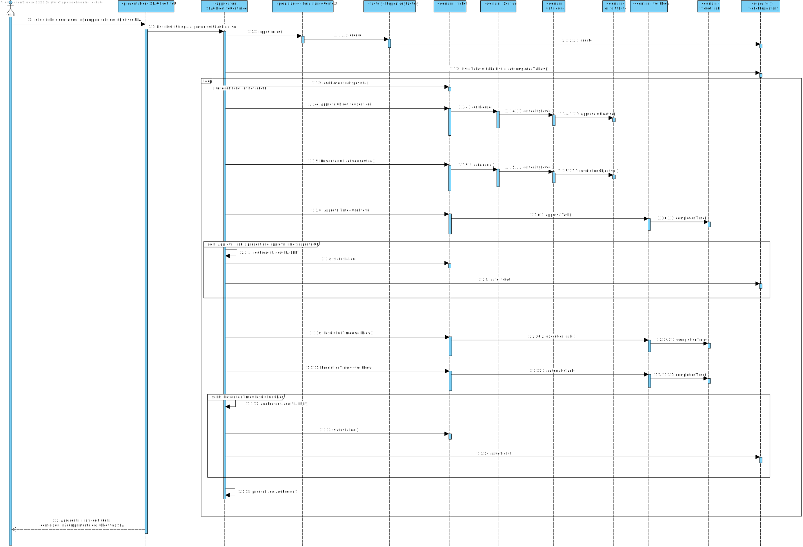

US2013 - Listar o (in)cumprimento do SLA
=======================================

# 1. Requisitos

**US2013:**  Como GSH, eu pretendo obter uma listagem sobre o (in)cumprimento do SLA das solicitações recebidas e já concluídas num determinado intervalo de tempo.

# 2. Análise

Para análise o modelo de domínio dá resposta ao requisito, não sendo assim necessário estender o mesmo. [Verificar modelo de domínio](https://bitbucket.org/1190731/lei20_21_s4_2dl_1/src/master/Modelo%20de%20Dominio.svg)

# 3. Design

## 3.1. Diagrama de Classes

### Listar o (in)cumprimento do SLA

# 4. Implementação

### SLAObjectivesController
	 public List<List<String>> SLAObjective(){
        TicketRepository ticketRepository = PersistenceContext.repositories().tickets();
        List<Ticket> ticketList = ticketRepository.getCompletedTickets();
        List<List<String>> present = new ArrayList<>();

        for (Ticket ticket:ticketList){
            List<String> addPresent = new ArrayList<>();
            addPresent.add(ticket.displayInfo());
            //Approval Objective
            String[] ApprovalObjective= ticket.service().catalogue().criticalityLevel().approvalObjective().tempoMaximo().split(":");
            long ApprovalObjectiveM=Long.parseLong(ApprovalObjective[0])*60+Long.parseLong(ApprovalObjective[1]);
            long ApprovalTime=0;
            String completionStateA="Objetivos de aprovação SLA:COMPLETED | ";

            //Resolution Objective
            String[] ResolutionObjective= ticket.service().catalogue().criticalityLevel().approvalObjective().tempoMaximo().split(":");
            long ResolutionObjectiveM=Long.parseLong(ResolutionObjective[0])*60+Long.parseLong(ResolutionObjective[1]);
            long ResolutionTime=0;
            String completionStateR="Objetivos de resolução SLA:COMPLETED | ";

            //If there is an approval task
            if (ticket.workflow().approvalTask().isPresent()) {
                //Approval task completion time
                ApprovalTime=ticket.workflow().approvalTask().get().completionTime();
                if (ApprovalObjectiveM-ApprovalTime<0) {
                    if(!ticket.status().toString().equals("FAILED")) {
                        ticket.statusFailed();
                        ticketRepository.save(ticket);
                    }
                    completionStateA = "Objetivos de aprovação SLA:FAILED | ";
                }
            }

            //If there is an execution task
            if (ticket.workflow().executionTask().isPresent()) {
                //Execution task completion time
                ResolutionTime=ticket.workflow().executionTask().get().completionTime();
            }

            if (ticket.workflow().automaticTask().isPresent()) {
                //Execution task completion time
                ResolutionTime+=ticket.workflow().automaticTask().get().completionTime();
            }

            if (ResolutionObjectiveM-ResolutionTime<0) {
                if(!ticket.status().toString().equals("FAILED")) {
                    ticket.statusFailed();
                    ticketRepository.save(ticket);
                }
                completionStateR = "Objetivos de resolução SLA:FAILED | ";
            }
            addPresent.add(completionStateA);
            addPresent.add(completionStateR);
            present.add(addPresent);
        }
        return present;
    }

# 5. Integração/Demonstração

Esta UC decorreu sem nenhum contratempo, a implementação foi rapida e eficaz.

# 6. Observações

Esta funcionaliade encotra-se de acordo com os requesito.

