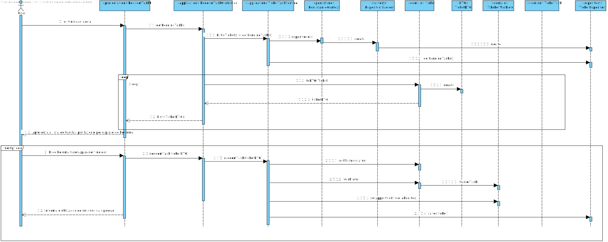

# UC 3022 - Reivindicar Tarefa
=======================================

# 1. Requisitos

**UC 3022:**  Como utilizador, eu pretendo consultar as tarefas pendentes que eu posso reivindicar para mim e, caso o deseje, concretize essa reivindicação.

# 2. Análise

Para análise o modelo de domínio dá resposta ao requisito, não sendo assim necessário estender o mesmo. [Verificar modelo de domínio](https://bitbucket.org/1190731/lei20_21_s4_2dl_1/src/master/Modelo%20de%20Dominio.svg)

# 3. Design

## 3.1. Realização da Funcionalidade

### Especificar Colaborador

## 3.2. Diagrama de Classes

## 3.3. Padrões Aplicados

* Pardrão Builder - Para evitar diferentes construtores para diferentes situações e para possibilitar a criação do catalogo por etapas foi usado o padrão Builder.
* Pardrão Factory - e modo a simplificar a a manipulação de diferentes repositorios foi utilizado o padrão Factory.
* Pardrão DTO - de modo a passar informação da camada de dominio para a camada de apresentação foi utilizado o padrão DTO, isolando assim o modelo de dominio da apresentação.

## 3.4. Testes 

**Teste 1:** Verifica que o nome completo tem pelo menos 3 nomes, nao pode estar vazio ou ser nulo.

	@Test
    public void teste(){
        assertEquals(nomeCompleto, new NomeCompleto("José Miguel Freitas"));
        assertNotEquals(nomeCompleto, new NomeCompleto("José Castelo Branco"));
        assertThrows(IllegalArgumentException.class,() -> new NomeCompleto("José Freitas"));
        assertThrows(IllegalArgumentException.class,() -> new NomeCompleto(""));
        assertThrows(IllegalArgumentException.class,() -> new NomeCompleto(null));
    }

# 4. Implementação

### Colaborador Builder
	public class ColaboradorBuilder implements DomainFactory<Colaborador>{
		private Morada morada;
		private Contacto contacto;
		private NomeCompleto nomeCompleto;
		private EmailInstitucional email;
		private NumeroMecanografico mNumber;
		private Alcunha alcunha;
		private DataDeNascimento dataDeNascimento;

		private Funcao funcao;
		private Colaborador supervisor;

		...

		@Override
		public Colaborador build() {
			return new Colaborador(morada, contacto, nomeCompleto,email,mNumber, alcunha,dataDeNascimento,funcao,supervisor);
		}

### Colaborador DTO

	@DTO
	public class ColaboradorDTO {
    	public String rua;
    	public String numPorta;
    	public String andar;
    	public String localizacao;
    	public String codPostal;
    	public String contacto;
    	public String nomeCompleto;
    	public String email;
	    public String mNumber;
    	public String alcunha;
    	public String dataDeNascimento;
    	public String designacao;
    	public String IDfuncao;
    	public String mSupervisor;

    	public ColaboradorDTO(String rua, String numPorta, String andar, 	String localizacao, String codPostal, String contacto, String nomeCompleto, String email, String mNumber, String alcunha, String dataDeNascimento) {
        this.rua = rua;
        this.numPorta = numPorta;
        this.andar = andar;
        this.localizacao = localizacao;
        this.codPostal = codPostal;
        this.contacto = contacto;
        this.nomeCompleto = nomeCompleto;
        this.email = email;
        this.mNumber = mNumber;
        this.alcunha = alcunha;
        this.dataDeNascimento = dataDeNascimento;
    }

### Colaborador DTO Parser
	public class ColaboradorDTOParser implements DTOParser<ColaboradorDTO, Colaborador> {

    final CollaboratorRepository collabRepo = PersistenceContext.repositories().collaborators();

    @Override
    public Colaborador valueOf(ColaboradorDTO dto) {
        ColaboradorBuilder colaboradorBuilder = new ColaboradorBuilder();
        if (dto.mSupervisor!=null)
            return colaboradorBuilder.withAddress(dto.rua,dto.numPorta,dto.andar,dto.localizacao,dto.codPostal).withContact(dto.contacto).withFullName(dto.nomeCompleto)
                .withInstitutionalEmail(dto.email).withMecanoGraphicNumber(dto.mNumber).withNickname(dto.alcunha).withDateOfBirth(dto.dataDeNascimento).withFunction(dto.IDfuncao,dto.designacao).build();

        final CollaboratorRepository collabRepo = PersistenceContext.repositories().collaborators();
        Optional<Colaborador> supervisor = collabRepo.ofIdentity(new NumeroMecanografico(dto.mSupervisor));
        return colaboradorBuilder.withAddress(dto.rua,dto.numPorta,dto.andar,dto.localizacao,dto.codPostal).withContact(dto.contacto).withFullName(dto.nomeCompleto)
                .withInstitutionalEmail(dto.email).withMecanoGraphicNumber(dto.mNumber).withNickname(dto.alcunha).withDateOfBirth(dto.dataDeNascimento)
                .withFunction(dto.IDfuncao,dto.designacao).withSupervisor(supervisor.get()).build();
    }

# 5. Integração/Demonstração

Esta implementação decorreu-se sem grandes problemas, devido a experiencia do sprint passado, bem como a boa estrutura ja existente do projeto

# 6. Observações

Esta funcionaliade encotra-se de acordo com os requesitos.

