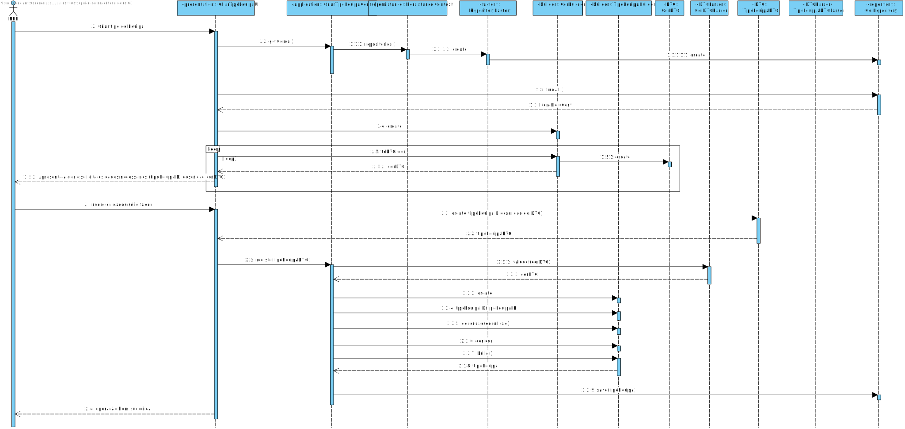

# UC 2054 - Registar tipo de Equipa
=======================================

# 1. Requisitos

**UC 2054:**  Como RRH, eu pretendo registar um novo tipo de equipa.

# 2. Análise

Para análise o modelo de domínio dá resposta ao requisito, não sendo assim necessário estender o mesmo. [Verificar modelo de domínio](https://bitbucket.org/1190731/lei20_21_s4_2dl_1/src/master/Modelo%20de%20Dominio.svg)

# 3. Design

## 3.1. Realização da Funcionalidade

### Especificar Criticidade

## 3.2. Diagrama de Classes

## 3.3. Padrões Aplicados

* Pardrão Builder - Para evitar diferentes construtores para diferentes situações e para possibilitar a criação do catalogo por etapas foi usado o padrão Builder.
* Pardrão Factory - e modo a simplificar a a manipulação de diferentes repositorios foi utilizado o padrão Factory.
* Pardrão DTO - de modo a passar informação da camada de dominio para a camada de apresentação foi utilizado o padrão DTO, isolando assim o modelo de dominio da apresentação.

## 3.4. Testes 

**Teste 1:** Verifica que a o ID do tipo de equipa não é grande demais, nao pode estar vazio ou ser nulo.

	@Test
    public void test(){
        assertEquals(tipoEquipaID, new TipoEquipaID("T12"));
        assertNotEquals(tipoEquipaID, new TipoEquipaID("T13"));
        assertThrows(IllegalArgumentException.class,() -> new TipoEquipaID("IDGRANDE"));
        assertThrows(IllegalArgumentException.class,() -> new TipoEquipaID(""));
        assertThrows(IllegalArgumentException.class,() -> new TipoEquipaID(null));
    }

**Teste 2:**Verifica se o valor Hexadecimal cumpre o formato e o tamanho especificado,se nao esta vazio nem é null.

	 @Test
    public void teste(){
        assertNotEquals(valorHexadecimal, new Hexadecimal("0000FE"));
        assertThrows(IllegalArgumentException.class,() -> new Hexadecimal("0000FER"));
        assertThrows(IllegalArgumentException.class,() -> new Hexadecimal("a"));
        assertThrows(IllegalArgumentException.class,() -> new Hexadecimal(""));
        assertThrows(IllegalArgumentException.class,() -> new Hexadecimal(null));
    }

# 4. Implementação

### Tipo de Equipa Builder
	public class TipoEquipaBuilder implements DomainFactory<TipoEquipa> {
    private TipoEquipaID tipoEquipaID;
    private String descricao;
    private Cor cor;

		...

		 @Override
    public TipoEquipa build(){
        return new TipoEquipa(tipoEquipaID,descricao,cor);
    }

### Tipo de Equipa DTO

	@DTO
    public class TipoEquipaDTO {
        public String code;
        public String descricao;
        public CorDTO corDTO;

        public TipoEquipaDTO(String code, String descricao, CorDTO corDTO) {
            this.code = code;
            this.descricao = descricao;
            this.corDTO = corDTO;
        }
        ...

### Tipo de Equipa DTO Parser
        public class TipoEquipaDTOParser implements DTOParser<TipoEquipaDTO, TipoEquipa> {
        
        @Override
        public TipoEquipa valueOf(TipoEquipaDTO dto) {
            TipoEquipaBuilder tipoEquipaBuilder = new TipoEquipaBuilder();
            return tipoEquipaBuilder.tipoEquipaID(dto.code).descricao(dto.descricao).cor(new CorDTOParser().valueOf(dto.corDTO)).build();
        }
}

# 5. Integração/Demonstração

A implementação desta funcionalidade decorreu com poucos problemas graças as prévias implementações.

# 6. Observações

Esta funcionaliade encotra-se de acordo com os requesitos, o tralho em equipa facilitou esta implementação, pois a implementação das UC's associadas foram faceis de perceber.

